<a id="top-en"></a>
<div align="center">

**🇬🇧 [English](#top-en) &nbsp;|&nbsp; 🇹🇷 [Türkçe](#top-tr)**

</div>

# 🏢 Application Management System

> Enterprise application and form management platform with role-based workflow, JWT security, and full-stack Docker deployment.

<div align="center">


<br/>


[Architecture](#system-architecture) · [Features](#features) · [API](#api-endpoints) · [Database](#database) · [Docker](#docker--deployment) · [Screenshots](#screenshots) · [Installation](#installation)

</div>

---

<div align="center">
  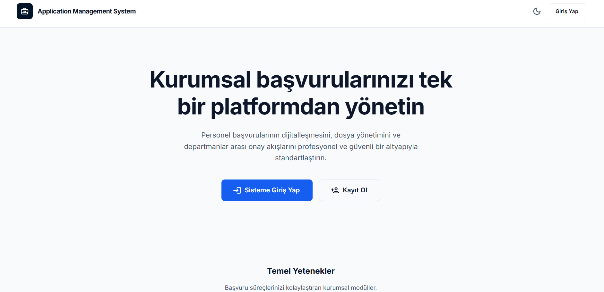
</div>

---

## 📖 Table of Contents
- [✨ What's New](#whats-new)
- [🎯 Project Description](#project-description)
- [💡 Why This Project?](#why-this-project)
- [✨ Features](#features)
- [🔭 System at a Glance](#system-at-a-glance)
- [🏗️ System Architecture](#system-architecture)
- [🔄 Application Workflow](#application-workflow)
- [🔐 Security Architecture](#security-architecture)
- [📊 Dashboard & Reporting](#dashboard--reporting)
- [🎨 UI / UX Showcase](#ui--ux-showcase)
- [🛠️ Technologies](#technologies)
- [🧠 Key Technical Decisions](#key-technical-decisions)
- [📜 Business Rules](#business-rules)
- [🗄️ Database](#database)
- [🔌 API Contract & OpenAPI](#api-contract--openapi)
- [🌐 API Endpoints](#api-endpoints)
- [📂 Project Structure](#project-structure)
- [🐳 Docker & Deployment](#docker--deployment)
- [🧪 Testing & Quality](#testing--quality)
- [🚀 Installation](#installation)
- [⚙️ Environment Variables](#environment-variables)
- [📸 Screenshots](#screenshots)
- [🗺️ Roadmap](#roadmap)
- [🔮 Future Improvements](#future-improvements)
- [ℹ️ Project Information](#project-information)
- [📄 License](#license)

---

<a id="whats-new"></a>
## ✨ What's New

Hold onto your hats! We've just shipped some fresh out of the oven features to make your life way easier (and cooler).

### 🕵️ Audit Log & History
Ever wondered "who approved this!?" or "when did this application go missing in action?" We've got you covered. The **Audit Log & History Subsystem** is here to snitch on everyone (in a good way).

> [!TIP]
> **Key Capabilities:**
> - 🔍 **Complete Audit Trail:** Automatically records every status transition, update, and action performed on an application. No hiding anymore!
> - ⏱️ **Chronological Tracking:** Captures precise timestamps for all historical events to ensure compliance and traceability.
> - 👤 **Actor Accountability:** Logs the identity of the user (actor) initiating the action. We know who did it.
> - 📊 **Centralized Timeline:** Presents the entire lifecycle of an application in a centralized, easily readable timeline. It's like scrolling through social media, but for corporate forms!

### 🔔 Real-time Notifications & Notification Center
No more refreshing the page like a maniac! We've introduced a brand-new **In-App Notification Center** with real-time Server-Sent Events (SSE). 

> [!TIP]
> **Key Capabilities:**
> - ⚡ **Real-time Updates:** Get notified instantly when something happens. Pop-ups so smooth, you'll actually want to see them.
> - 📥 **Notification Center:** A sleek, dedicated hub to view, manage, and dismiss all your alerts.
> - 🧹 **Clean & Tidy:** Mark all as read or delete everything with a single click. Start fresh whenever you want!

---

<a id="project-description"></a>
## 🎯 Project Description

Leave, training, advance, material, and assignment requests within organizations are often managed via scattered email threads, Excel spreadsheets, or verbal communication. This traditional approach lacks centralized tracking and makes it difficult to maintain a clear audit trail.

The **Application Management System** is a web-based platform where personnel can submit and track applications, while administrators can review, approve or reject, and generate reports on them. It provides a workflow supporting various form types, a status lifecycle, file attachments, and an analytics dashboard.

---

<a id="why-this-project"></a>
## 💡 Why This Project?

- Replaces scattered email/Excel requests with a centralized digital workflow.
- Provides a clear audit trail with an explicit approval lifecycle (`NEW` → `IN_REVIEW` → `APPROVED` / `REJECTED`).
- Secures application data using role-based JWT authentication.
- Automates reporting with dashboard KPIs and analytical summaries.
- Manages file attachments per application.

---


<a id="system-at-a-glance"></a>
## 🔭 System at a Glance


```mermaid
flowchart TD
    Browser(["🌐 Browser"])
    Nginx["🧭 Nginx Container<br/>Reverse Proxy + SPA"]
    Backend["⚙️ Spring Boot Container<br/>REST API"]
    DB[("🗄️ PostgreSQL Container")]
    Storage[("📁 Persistent File Storage")]

    Browser -->|"HTTP request"| Nginx
    Nginx -.->|"Static / SPA response"| Browser
    Nginx -->|"/api/*"| Backend
    Nginx -->|"/swagger-ui/*"| Backend
    Backend --> DB
    Backend --> Storage

    classDef client fill:#E0F2FE,stroke:#0284C7,color:#0C4A6E,stroke-width:1px
    classDef proxy fill:#FEF3C7,stroke:#D97706,color:#78350F,stroke-width:1px
    classDef service fill:#DCFCE7,stroke:#16A34A,color:#14532D,stroke-width:1px
    classDef data fill:#EDE9FE,stroke:#7C3AED,color:#4C1D95,stroke-width:1px

    class Browser client
    class Nginx proxy
    class Backend service
    class DB,Storage data
```

> All three services run as Docker containers orchestrated via Docker Compose.

---

<a id="system-architecture"></a>
## 🏗️ System Architecture

<div align="center">
  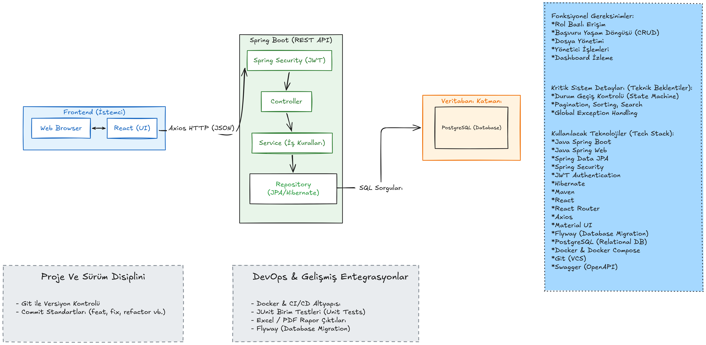
</div>

> System design whiteboard showing the overall architecture, entity relationships, and request/response flow. ([Source Excalidraw file](docs/architecture/system-design.excalidraw))

---

<a id="features"></a>
## ✨ Features

### 👤 Personnel Features
- Registration with email validation and custom password rules (`@ValidPassword`)
- Login → access token + refresh token pair
- **Session restoration:** On page reload, existing access token in `sessionStorage` is used to restore user state via `GET /users/me`
- **Automatic access token renewal:** On 401 response, Axios interceptor transparently refreshes tokens via `POST /auth/refresh-token` with rotation (old token invalidated, new pair issued)
- Create applications (title, description, form type selection)
- View own applications — paginated, sorted, filtered (Specification pattern)
- View application detail with attachments
- Edit applications (only while in `NEW` status)
- Cancel applications (from `NEW` or `IN_REVIEW` status)
- Delete applications (only while in `NEW` status)
- Upload, download, and delete file attachments
- Profile view and update
- Logout with server-side refresh token revocation

### 🛡️ Admin Features
- Dashboard with KPI cards: total, pending, approved, rejected, cancelled, today's count
- Latest applications list on dashboard
- View all applications — paginated, sorted, filtered
- Move application to review (`NEW` → `IN_REVIEW`)
- Approve application (`IN_REVIEW` → `APPROVED`)
- Reject application (`IN_REVIEW` → `REJECTED`)
- User management — list, search, view detail
- Activate / deactivate users
- Update user details
- Form type CRUD — create, update, activate/deactivate
- Reports with date range, status, and form type filters
- Status distribution and form type distribution analytics

### 🔐 Security Features
- JWT access tokens + refresh tokens
- Refresh token hashed with SHA-256, stored in database
- Refresh token rotation — old token deleted on use, new pair issued
- BCrypt password hashing (cost factor 12)
- Stateless sessions (`SessionCreationPolicy.STATELESS`)
- Method-level security via `@PreAuthorize`
- Custom `JwtAuthenticationEntryPoint` (structured 401 JSON)
- Custom `JwtAccessDeniedHandler` (structured 403 JSON)
- Token stored in `sessionStorage` (cleared on tab close)
- Scheduled expired/revoked token cleanup (daily cron)
- CORS configuration for development and Docker environments
- Custom `@ValidPassword` constraint annotation + validator

### 🛠️ Platform Features
- Global exception handling (`@RestControllerAdvice` + typed `ErrorCode` enum with 20+ entries)
- Bean Validation (`jakarta.validation`)
- Flyway schema migrations (7 versions, source of truth for schema)
- Hibernate `validate` mode (schema not auto-generated)
- MapStruct DTO mapping (5 mappers)
- Specification pattern for dynamic, type-safe search
- OpenAPI documentation with Swagger UI
- OpenAPI-generated TypeScript Axios client
- In-app Notification Center
- Real-time notifications using Server-Sent Events (SSE)
- Spring Boot Actuator
- Docker Compose (3 services, healthcheck, 2 persistent volumes)
- Nginx reverse proxy (SPA fallback + API/Swagger proxy + static asset caching)
- Multi-stage Dockerfiles (Node 22 build + Nginx runtime, Maven + Temurin 21 runtime)
- Responsive UI with Material UI component library
- Dark / Light mode (ThemeContext with custom design tokens)
- Inter font family via `@fontsource/inter`
- Landing page
- Automatic admin user initialization on first startup (`AdminInitializer`)

---

<a id="application-workflow"></a>
## 🔄 Application Workflow

**Verified transitions** (from `ApplicationValidator` + `ApplicationFormServiceImpl`):

```text
NEW        → IN_REVIEW   (Admin: moveToReview)
NEW        → CANCELLED   (Personnel: cancel)
IN_REVIEW  → APPROVED    (Admin: approve)
IN_REVIEW  → REJECTED    (Admin: reject)
IN_REVIEW  → CANCELLED   (Personnel: cancel)
APPROVED   → (terminal)
REJECTED   → (terminal)
CANCELLED  → (terminal)
```

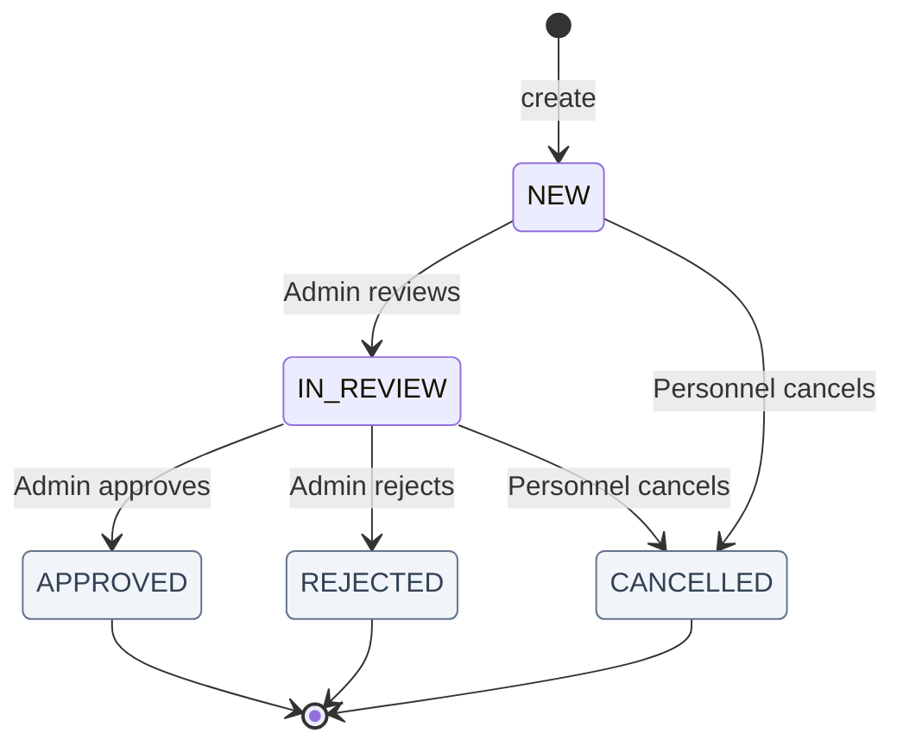
```mermaid
stateDiagram-v2
    [*] --> NEW : create

    NEW --> IN_REVIEW : Admin reviews
    NEW --> CANCELLED : Personnel cancels

    IN_REVIEW --> APPROVED : Admin approves
    IN_REVIEW --> REJECTED : Admin rejects
    IN_REVIEW --> CANCELLED : Personnel cancels

    APPROVED --> [*]
    REJECTED --> [*]
    CANCELLED --> [*]

    classDef terminal fill:#F1F5F9,stroke:#64748B,color:#334155
    class APPROVED,REJECTED,CANCELLED terminal
```

| Status | 📄 Description | 👤 Triggered By | 🔀 Allowed Transitions |
|---|---|---|---|
| `NEW` | Freshly created application | System (on create) | → `IN_REVIEW`, → `CANCELLED` |
| `IN_REVIEW` | Under admin evaluation | Admin | → `APPROVED`, → `REJECTED`, → `CANCELLED` |
| `APPROVED` | Approved by admin | Admin | *Terminal — no further transitions* |
| `REJECTED` | Rejected by admin | Admin | *Terminal — no further transitions* |
| `CANCELLED` | Cancelled by applicant | Personnel | *Terminal — no further transitions* |

---

<a id="security-architecture"></a>
## 🔐 Security Architecture

- Spring Security filter chain configuration (stateless)
- `JwtAuthenticationFilter` on every request
- JWT via jjwt library (access + refresh tokens)
- Refresh token: SHA-256 hashed, stored in DB, deleted on use (rotation)
- BCrypt password encoding (cost factor 12)
- `@EnableMethodSecurity` + `@PreAuthorize` on controller endpoints
- Custom 401/403 JSON error handlers
- Auth endpoints public, all others require authentication
- `sessionStorage` for client-side token storage (not `localStorage`)
- Scheduled token cleanup (`RefreshTokenCleanupScheduler`, cron `0 30 3 * * *`)

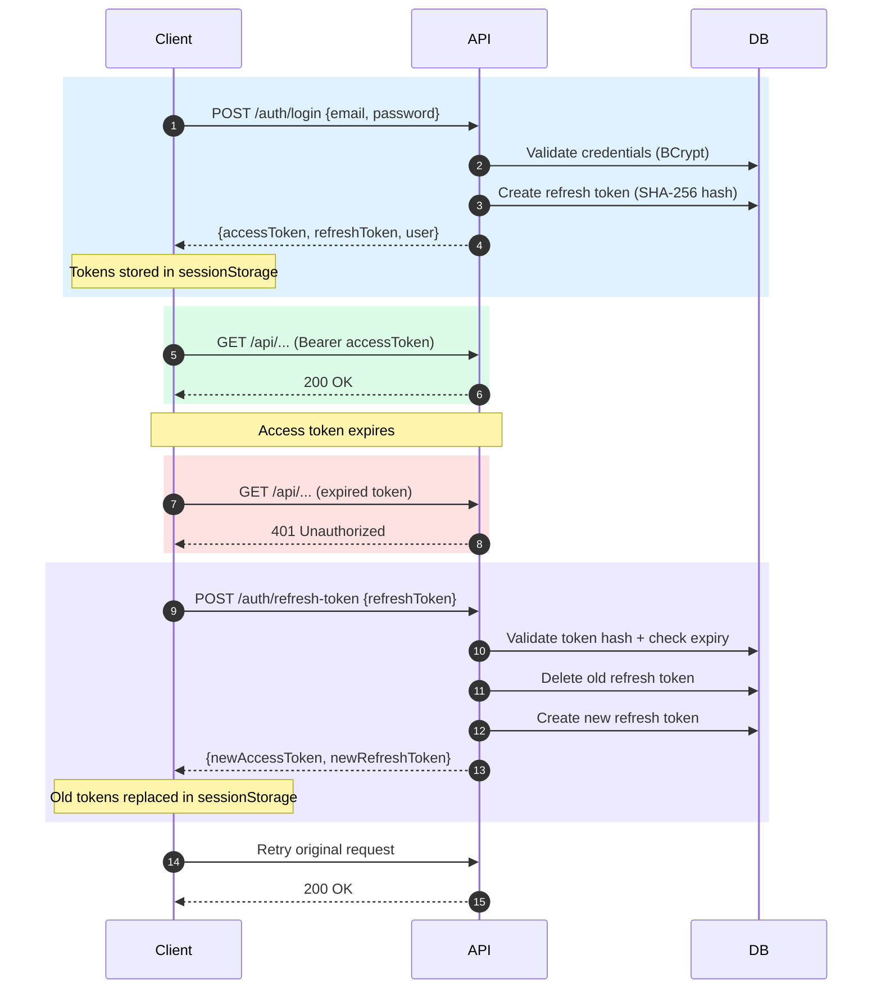
```mermaid
sequenceDiagram
    autonumber
    participant Client
    participant API
    participant DB

    rect rgb(224, 242, 254)
    Client->>API: POST /auth/login {email, password}
    API->>DB: Validate credentials (BCrypt)
    API->>DB: Create refresh token (SHA-256 hash)
    API-->>Client: {accessToken, refreshToken, user}
    Note over Client: Tokens stored in sessionStorage
    end

    rect rgb(220, 252, 231)
    Client->>API: GET /api/... (Bearer accessToken)
    API-->>Client: 200 OK
    end

    Note over Client,API: Access token expires

    rect rgb(254, 226, 226)
    Client->>API: GET /api/... (expired token)
    API-->>Client: 401 Unauthorized
    end

    rect rgb(237, 233, 254)
    Client->>API: POST /auth/refresh-token {refreshToken}
    API->>DB: Validate token hash + check expiry
    API->>DB: Delete old refresh token
    API->>DB: Create new refresh token
    API-->>Client: {newAccessToken, newRefreshToken}
    Note over Client: Old tokens replaced in sessionStorage
    end

    Client->>API: Retry original request
    API-->>Client: 200 OK
```

> [!IMPORTANT]
> **Session Restoration vs. Automatic Token Refresh**
> - **Session Restoration** — On page reload, the app checks `sessionStorage` for an existing access token and calls `GET /users/me` to restore the user profile without re-entering credentials.
> - **Automatic Token Refresh** — When an API call receives a 401 response, the Axios interceptor transparently calls `/auth/refresh-token`, replaces both tokens in `sessionStorage` (rotation), and retries the failed request. Concurrent requests are queued during refresh.

---

<a id="dashboard--reporting"></a>
## 📊 Dashboard & Reporting

The dashboard and reporting modules provide real-time metrics and analytics using **Recharts** (pie charts, bar charts).

**📈 Dashboard KPIs** (from `DashboardResponse`):
- Total applications
- Pending applications (`NEW` + `IN_REVIEW`)
- Approved / Rejected / Cancelled counts
- Today's applications
- Latest applications list

**📋 Reports** (from `ApplicationReportResponse`):
- Date range filter (start, end)
- Status filter
- Form type filter
- KPI breakdown: total, new, inReview, approved, rejected, cancelled
- Form type distribution (`applicationsByFormType`)

<div align="center">
  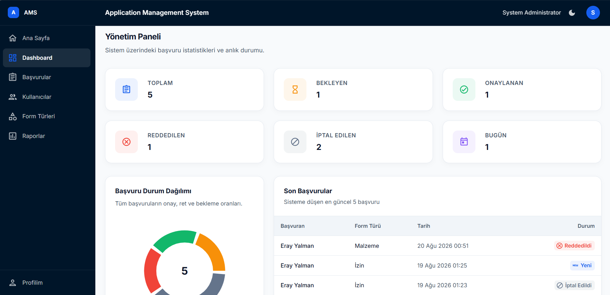
  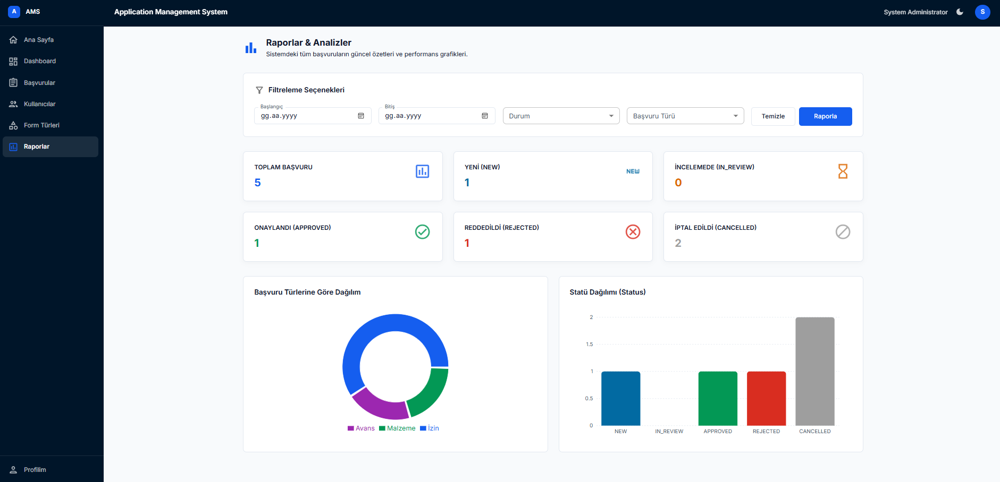
</div>

---

<a id="ui--ux-showcase"></a>
## 🎨 UI / UX Showcase

The frontend leverages the robust **Material UI v9** design system, utilizing a comprehensive custom theme (`theme.ts` — 290 lines) that defines specific design tokens for both light and dark palettes.

**Highlights:**
- 🧩 Responsive `AppLayout` with collapsible `AppSidebar` + `AppHeader`
- 🌓 Seamless Dark/Light mode toggle via `ThemeContext`
- ✒️ Crisp typography powered by `@fontsource/inter`

| ☀️ Light Mode | 🌙 Dark Mode |
|---|---|
|  | 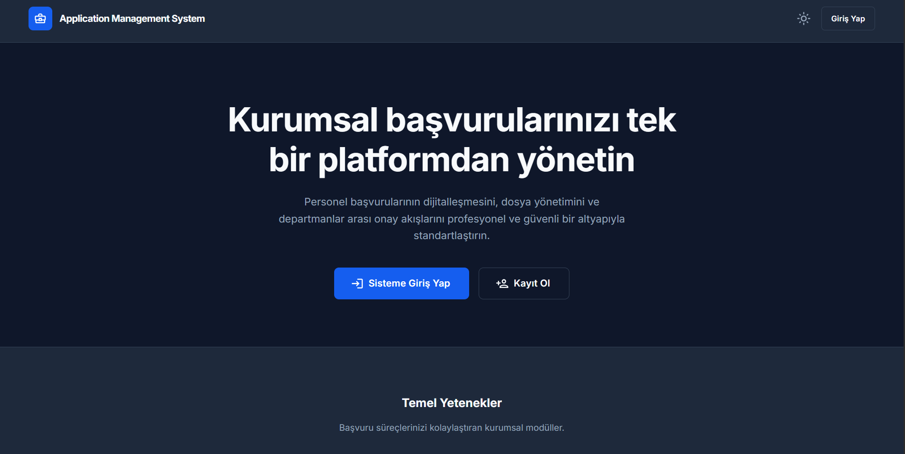 |

---

<a id="technologies"></a>
## 🛠️ Technologies

### ⚙️ Backend
| Technology | Version | Purpose |
|---|---|---|
| **Java** | 21 | Runtime platform |
| **Spring Boot** | 3.5.16 | Application framework |
| **Spring Security** | Managed | Authentication & authorization |
| **Spring Data JPA** | Managed | Data access layer |
| **Hibernate** | Managed | ORM — `validate` mode |
| **PostgreSQL** | 16 | Relational database |
| **Flyway** | Managed | Database schema migration |
| **JWT (jjwt)** | 0.12.7 | Token-based authentication |
| **MapStruct** | 1.6.3 | Compile-time DTO ↔ Entity mapping |
| **Lombok** | 1.18.46 | Boilerplate reduction |
| **SpringDoc OpenAPI** | 2.8.9 | API documentation & Swagger UI |
| **Bean Validation** | Managed | Request validation |
| **Spring Boot Actuator** | Managed | Application monitoring endpoints |
| **Maven** | Wrapper | Build & dependency management |

### ⚛️ Frontend
| Technology | Version | Purpose |
|---|---|---|
| **React** | 19 | UI library |
| **TypeScript** | 6 | Type-safe development |
| **Vite** | 8 | Build tool & dev server |
| **Material UI (MUI)** | 9 | Component library |
| **MUI X Data Grid** | 9 | Advanced data tables with sorting, filtering, pagination |
| **React Router** | 7 | Client-side routing |
| **TanStack Query** | 5 | Server state management & caching |
| **Axios** | 1.19 | HTTP client with interceptors |
| **React Hook Form** | 7 | Form state management |
| **Zod** | 4 | Schema validation |
| **Recharts** | 3 | Data visualization (charts) |
| **Emotion** | 11 | CSS-in-JS styling engine (MUI) |
| **Inter (Fontsource)** | 5 | Typography |

### ☁️ Infrastructure
| Technology | Version | Purpose |
|---|---|---|
| **Docker** | — | Containerization |
| **Docker Compose** | — | Multi-container orchestration |
| **Nginx** | 1.27-alpine | Reverse proxy, SPA serving, static caching |
| **Node** | 22-alpine | Frontend build stage |
| **Maven** | 3.9 + Temurin 21 | Backend build stage |
| **Eclipse Temurin** | 21-jre-alpine | Backend runtime |

---

<a id="key-technical-decisions"></a>
## 🧠 Key Technical Decisions

1. **DTO + MapStruct** — Entities never exposed to API; compile-time mappers prevent runtime reflection overhead.
2. **Specification Pattern** — `ApplicationFormSpecification`, `UserSpecification` → dynamic, type-safe, composable queries without raw SQL.
3. **JWT + Refresh Token Rotation** — Stateless auth without server-side sessions. Old refresh tokens deleted on use → mitigates token theft.
4. **SHA-256 Token Hashing** — Raw refresh tokens never stored in database; only hashes persisted.
5. **Flyway + Hibernate Validate** — Flyway migrations are the single source of truth for schema. Hibernate only validates entity mapping against existing schema.
6. **`sessionStorage` over `localStorage`** — Tokens cleared automatically on tab/browser close → reduces attack surface for XSS token theft.
7. **Global Exception Handling** — `@RestControllerAdvice` + typed `ErrorCode` enum → consistent, machine-readable error responses across all endpoints.
8. **API Client Generation** — The OpenAPI-generated TypeScript Axios client handles the low-level API contract, while frontend service wrappers and hooks provide application-level abstraction.
9. **Docker + Nginx Reverse Proxy** — Single-origin deployment. SPA fallback + `/api/*` proxy → no CORS in production.
10. **Feature-based Frontend Architecture** — Domain-driven directory structure (`features/applications/`, `features/auth/`, etc.) with co-located API, hooks, pages, schemas.
11. **TanStack Query** — Server-state caching, background refetching, mutation-based cache invalidation. No manual state management for API data.
12. **Persistent Docker Volumes** — `postgres_data` + `app_storage` survive container rebuilds.
13. **Admin Auto-Initialization** — `CommandLineRunner` creates admin user from environment variables on first startup.
14. **Scheduled Token Cleanup** — Daily cron job purges expired/revoked refresh tokens from the database.
15. **Audit Logging vs. Notifications** — Audit logs explicitly record business history (who did what) for compliance, while the Notification subsystem independently communicates relevant events to users.
16. **Real-time Notifications (SSE)** — Server-Sent Events are used for one-way server-to-client realtime notifications instead of WebSockets, reducing architectural complexity.
17. **Notification Persistence** — Notifications are securely scoped to the authenticated user and stored in PostgreSQL via REST for management, strictly separated from realtime delivery.

---

<a id="business-rules"></a>
## 📜 Business Rules

| ⚖️ Rule | 🔒 Enforced By |
|---|---|
| Personnel can view only own applications | `ApplicationValidator.validateAccess()` |
| Admin can view all applications | `@PreAuthorize("hasRole('ADMIN')")` on `getAllApplications` |
| Only `NEW` applications can be edited | `ApplicationValidator.validateUpdatable()` |
| Only `NEW` applications can be deleted | `ApplicationValidator.validateDeletable()` |
| Only `NEW` applications can be moved to review | `ApplicationValidator.validateReviewable()` |
| Only `IN_REVIEW` applications can be approved | `ApplicationValidator.validateApprovable()` |
| Only `IN_REVIEW` applications can be rejected | `ApplicationValidator.validateRejectable()` |
| Cancel allowed from `NEW` or `IN_REVIEW` | `ApplicationValidator.validateCancellable()` |
| `APPROVED`, `REJECTED`, `CANCELLED` are terminal | `ApplicationStatusValidator` ALLOWED_TRANSITIONS → empty set |
| Inactive form types cannot be used for new applications | `ApplicationFormServiceImpl.create()` → `InactiveFormTypeException` |
| Inactive form types cannot be used when editing | `ApplicationFormServiceImpl.updateApplicationForm()` → `InactiveFormTypeException` |
| Duplicate email registration blocked | DB unique constraint `uq_users_email` + `ErrorCode.EMAIL_ALREADY_EXISTS` |
| Duplicate form type name blocked | DB unique constraint `uq_form_types_name` + `ErrorCode.FORM_TYPE_ALREADY_EXISTS` |
| Already active user cannot be activated again | `UserValidator.validateActivation()` |
| Already inactive user cannot be deactivated again | `UserValidator.validateDeactivation()` |
| Refresh token deleted on use (rotation) | `RefreshTokenServiceImpl` — delete old, create new |
| Expired / revoked tokens rejected | `RefreshTokenServiceImpl.validate()` |
| File type and size restrictions on upload | `ErrorCode.INVALID_FILE_TYPE`, `ErrorCode.FILE_SIZE_EXCEEDED` |

---

<a id="database"></a>
## 🗄️ Database

**7 Tables (Flyway V1–V9):**

| Table | Migration | Purpose | Key Constraints |
|---|---|---|---|
| `users` | V1 | User accounts | PK UUID, UNIQUE email, CHECK role IN ('ADMIN','PERSONNEL'), `is_active` |
| `form_types` | V2 | Application categories | PK UUID, UNIQUE name, `is_active` |
| `application_forms` | V3 | Submitted applications | FK → users (`RESTRICT`), FK → form_types (`RESTRICT`), CHECK status |
| `attachments` | V4 | Uploaded files | FK → application_forms (`CASCADE`) |
| `refresh_tokens` | V7 | JWT refresh tokens | FK → users (`CASCADE`), UNIQUE token_hash, `revoked`, `expires_at` |
| `application_audit_logs` | V8 | Audit history | FK → application_forms, FK → users |
| `notifications` | V9 | User alerts | FK → users, `is_read` |

**Indexes (V6 + V7):**
- `idx_application_forms_user_id`
- `idx_application_forms_form_type_id`
- `idx_application_forms_status`
- `idx_attachments_application_form_id`
- `idx_refresh_tokens_user_id`
- `idx_refresh_tokens_expires_at`

**Seeded data (V5):** 5 default form types — İzin, Eğitim, Avans, Malzeme, Görev

> [!TIP]
> **Design Decisions:**
> - UUID primary keys (`gen_random_uuid()`)
> - `TIMESTAMPTZ` for all timestamps
> - Soft-active state on users and form_types via `is_active`
> - `ON DELETE RESTRICT` for referential integrity (users, form_types)
> - `ON DELETE CASCADE` for child data cleanup (attachments, refresh_tokens)
> - CHECK constraints for enum columns
> - Indexes on frequently queried foreign keys and filter columns

<div align="center">
  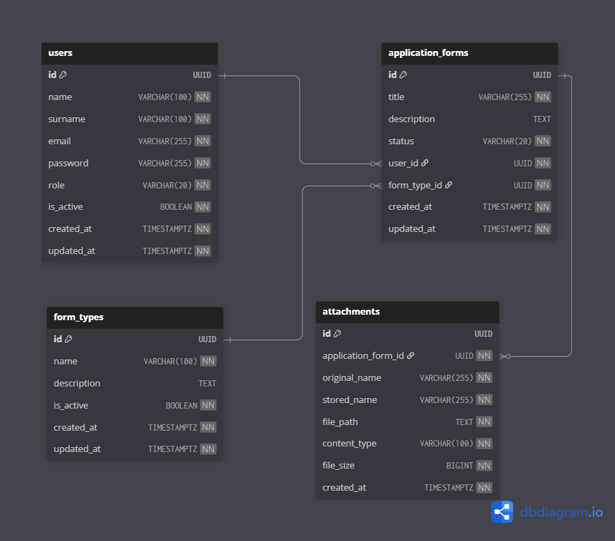
</div>

> [!IMPORTANT]
> Ensure `docs/architecture/db-schema.png` reflects the latest migration including the `refresh_tokens` table (added in V7).

---

<a id="api-contract--openapi"></a>
## 🔌 API Contract & OpenAPI

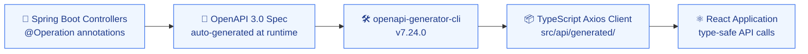
```mermaid
flowchart LR
    A["🧩 Spring Boot Controllers<br/>@Operation annotations"] --> B["📄 OpenAPI 3.0 Spec<br/>auto-generated at runtime"]
    B --> C["🛠️ openapi-generator-cli<br/>v7.24.0"]
    C --> D["📦 TypeScript Axios Client<br/>src/api/generated/"]
    D --> E["⚛️ React Application<br/>type-safe API calls"]

    classDef step fill:#EFF6FF,stroke:#2563EB,color:#1E3A8A,stroke-width:1px
    class A,B,C,D,E step
```

**Notes:**
- Generated client in `src/api/generated/` (134KB `api.ts`)
- Generated files committed to repository; manually editing is not recommended
- Regenerate when backend API changes
- Swagger UI: `http://localhost:3000/swagger-ui/index.html` (Docker) or `http://localhost:8080/swagger-ui.html` (dev)

---

<a id="api-endpoints"></a>
## 🌐 API Endpoints

**41 REST endpoints**

### 🔐 Authentication
| Method | Endpoint | Description | Auth |
|---|---|---|---|
| 🟢 `POST` | `/api/v1/auth/register` | Register new user | Public |
| 🟢 `POST` | `/api/v1/auth/login` | Authenticate user | Public |
| 🟢 `POST` | `/api/v1/auth/refresh-token` | Refresh access token | Public |
| 🟢 `POST` | `/api/v1/auth/logout` | Revoke refresh token | Public |

### 👥 Users
| Method | Endpoint | Description | Auth |
|---|---|---|---|
| 🔵 `GET` | `/api/v1/users/me` | Get current user profile | Authenticated |
| 🟠 `PUT` | `/api/v1/users/me` | Update own profile | Authenticated |
| 🔵 `GET` | `/api/v1/users/all` | List all users (paginated, searchable) | `ADMIN` |
| 🔵 `GET` | `/api/v1/users/{userId}` | Get user by ID | `ADMIN` |
| 🟠 `PUT` | `/api/v1/users/{userId}/update` | Update user | `ADMIN` |
| 🟡 `PATCH` | `/api/v1/users/{userId}/activate` | Activate user | `ADMIN` |
| 🟡 `PATCH` | `/api/v1/users/{userId}/deactivate` | Deactivate user | `ADMIN` |

### 📝 Applications
| Method | Endpoint | Description | Auth |
|---|---|---|---|
| 🟢 `POST` | `/api/v1/applications/create` | Create application | `PERSONNEL` |
| 🔵 `GET` | `/api/v1/applications/my` | List own applications (paginated, filtered) | `PERSONNEL` |
| 🔵 `GET` | `/api/v1/applications/all` | List all applications (paginated, filtered) | `ADMIN` |
| 🔵 `GET` | `/api/v1/applications/{id}` | Get application detail | `PERSONNEL` / `ADMIN` |
| 🟠 `PUT` | `/api/v1/applications/{id}` | Update application (NEW only) | `PERSONNEL` |
| 🔴 `DELETE` | `/api/v1/applications/{id}` | Delete application (NEW only) | `PERSONNEL` |
| 🟡 `PATCH` | `/api/v1/applications/{id}/cancel` | Cancel application | `PERSONNEL` |
| 🟡 `PATCH` | `/api/v1/applications/{id}/review` | Move to review | `ADMIN` |
| 🟡 `PATCH` | `/api/v1/applications/{id}/approve` | Approve application | `ADMIN` |
| 🟡 `PATCH` | `/api/v1/applications/{id}/reject` | Reject application | `ADMIN` |

### 📎 Attachments
| Method | Endpoint | Description | Auth |
|---|---|---|---|
| 🟢 `POST` | `/api/v1/attachments/applications/{id}` | Upload file | `PERSONNEL` / `ADMIN` |
| 🔵 `GET` | `/api/v1/attachments/applications/{id}` | List attachments for application | `PERSONNEL` / `ADMIN` |
| 🔵 `GET` | `/api/v1/attachments/{id}/download` | Download file | `PERSONNEL` / `ADMIN` |
| 🔴 `DELETE` | `/api/v1/attachments/{id}` | Delete attachment | `PERSONNEL` / `ADMIN` |

### 📁 Form Types
| Method | Endpoint | Description | Auth |
|---|---|---|---|
| 🔵 `GET` | `/api/v1/form-types` | List all form types | `PERSONNEL` / `ADMIN` |
| 🔵 `GET` | `/api/v1/form-types/{id}` | Get form type by ID | `PERSONNEL` / `ADMIN` |
| 🟢 `POST` | `/api/v1/form-types` | Create form type | `ADMIN` |
| 🟠 `PUT` | `/api/v1/form-types/{id}` | Update form type | `ADMIN` |
| 🟡 `PATCH` | `/api/v1/form-types/{id}/activate` | Activate form type | `ADMIN` |
| 🟡 `PATCH` | `/api/v1/form-types/{id}/deactivate` | Deactivate form type | `ADMIN` |

### 📈 Dashboard & Reports
| Method | Endpoint | Description | Auth |
|---|---|---|---|
| 🔵 `GET` | `/api/v1/dashboard` | Get dashboard KPIs | `ADMIN` |
| 🔵 `GET` | `/api/v1/reports/applications` | Get application report (filtered) | `ADMIN` |

### 🔔 Notifications
| Method | Endpoint | Description | Auth |
|---|---|---|---|
| 🔵 `GET` | `/api/v1/notifications` | List user notifications | `PERSONNEL` / `ADMIN` |
| 🔵 `GET` | `/api/v1/notifications/unread-count` | Get unread count | `PERSONNEL` / `ADMIN` |
| 🟡 `PATCH` | `/api/v1/notifications/{notificationId}/read` | Mark as read | `PERSONNEL` / `ADMIN` |
| 🟡 `PATCH` | `/api/v1/notifications/read-all` | Mark all as read | `PERSONNEL` / `ADMIN` |
| 🔴 `DELETE` | `/api/v1/notifications/{notificationId}` | Delete notification | `PERSONNEL` / `ADMIN` |
| 🔴 `DELETE` | `/api/v1/notifications` | Delete all notifications | `PERSONNEL` / `ADMIN` |
| 📡 `GET` | `/api/v1/notifications/stream` | Real-time SSE stream | `PERSONNEL` / `ADMIN` |

---

<a id="project-structure"></a>
## 📂 Project Structure

```text
application-management-system/
├── backend/
│   └── application-management/
│       ├── src/main/java/com/cybersoft/application_management/
│       │   ├── business/           # Status transition rules
│       │   ├── config/             # Admin init, JWT config, OpenAPI config
│       │   ├── controller/         # 7 REST controllers
│       │   ├── dto/                # Request / Response DTOs
│       │   │   ├── request/        #   13 request DTOs
│       │   │   └── response/       #   10 response DTOs
│       │   ├── entity/             # 5 JPA entities
│       │   ├── enums/              # ApplicationStatus, UserRole
│       │   ├── exception/          # Typed exceptions + ErrorCode enum
│       │   ├── handler/            # GlobalExceptionHandler
│       │   ├── mapper/             # 5 MapStruct mappers
│       │   ├── repository/         # JPA repositories
│       │   │   ├── specification/  #   Dynamic query specifications
│       │   │   └── impl/           #   Custom repository implementations
│       │   ├── scheduler/          # Refresh token cleanup cron
│       │   ├── security/           # JWT filter, config, handlers, UserDetails
│       │   ├── service/            # Service interfaces
│       │   │   ├── impl/           #   8 service implementations
│       │   │   └── validator/      #   Application & User validators
│       │   ├── storage/            # File storage abstraction
│       │   └── validation/         # Custom @ValidPassword annotation
│       ├── src/main/resources/
│       │   ├── application.yaml
│       │   └── db/migration/       # V1–V7 Flyway migration scripts
│       ├── src/test/               # JUnit 5 unit tests
│       ├── Dockerfile              # Multi-stage (Maven build + Temurin runtime)
│       └── pom.xml
├── frontend/
│   ├── src/
│   │   ├── api/
│   │   │   ├── client.ts           # Axios instance + refresh interceptor
│   │   │   ├── config.ts           # API config
│   │   │   └── generated/          # OpenAPI-generated TypeScript client
│   │   ├── app/
│   │   │   ├── router/             # React Router configuration
│   │   │   ├── providers/          # AppProviders, ThemeContext, QueryClient
│   │   │   └── theme.ts            # MUI theme (light + dark tokens)
│   │   ├── components/             # Shared: AppLayout, AppSidebar, AppHeader, StatusChip
│   │   ├── features/
│   │   │   ├── applications/       # Pages, hooks, API, components, schemas
│   │   │   ├── attachments/        # API, hooks
│   │   │   ├── auth/               # Context, guards, pages, schemas
│   │   │   ├── dashboard/          # Pages, hooks, API
│   │   │   ├── form-types/         # Pages, hooks, API, components, schemas
│   │   │   ├── home/               # Home page
│   │   │   ├── landing/            # Landing page
│   │   │   ├── profile/            # Pages, hooks, API, schemas
│   │   │   ├── reports/            # Pages, hooks, API
│   │   │   └── users/              # Pages, hooks, API, components, schemas
│   │   └── lib/                    # auth-storage (sessionStorage wrapper)
│   ├── Dockerfile                  # Multi-stage (Node build + Nginx runtime)
│   ├── nginx.conf                  # Reverse proxy + SPA fallback
│   └── package.json
├── docs/
│   └── architecture/               # Diagrams, whiteboard, Excalidraw source
├── docker-compose.yml
├── .env.example
└── README.md
```

---

<a id="docker--deployment"></a>
## 🐳 Docker & Deployment

**3 containers:**

| Service | Base Image | Internal Port | Purpose |
|---|---|---|---|
| `postgres` | `postgres:16` | 5432 | Database |
| `backend` | Multi-stage (Maven → Temurin 21 JRE Alpine) | 8080 | Spring Boot REST API |
| `frontend` | Multi-stage (Node 22 → Nginx 1.27 Alpine) | 80 | SPA + Reverse Proxy |

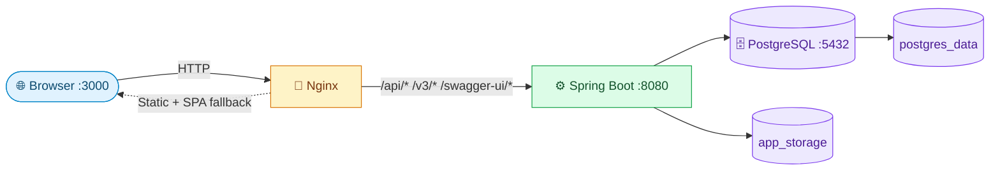
```mermaid
flowchart LR
    Browser(["🌐 Browser :3000"])
    Nginx["🧭 Nginx"]
    Backend["⚙️ Spring Boot :8080"]
    DB[("🗄️ PostgreSQL :5432")]
    Vol1[("postgres_data")]
    Vol2[("app_storage")]

    Browser -->|"HTTP"| Nginx
    Nginx -.->|"Static + SPA fallback"| Browser
    Nginx -->|"/api/* /v3/* /swagger-ui/*"| Backend
    Backend --> DB
    Backend --> Vol2
    DB --> Vol1

    classDef client fill:#E0F2FE,stroke:#0284C7,color:#0C4A6E,stroke-width:1px
    classDef proxy fill:#FEF3C7,stroke:#D97706,color:#78350F,stroke-width:1px
    classDef service fill:#DCFCE7,stroke:#16A34A,color:#14532D,stroke-width:1px
    classDef data fill:#EDE9FE,stroke:#7C3AED,color:#4C1D95,stroke-width:1px

    class Browser client
    class Nginx proxy
    class Backend service
    class DB,Vol1,Vol2 data
```

> [!IMPORTANT]
> **Nginx Proxy Rules:**
> - `/` → SPA fallback (`try_files $uri $uri/ /index.html`)
> - `/api/*` → `proxy_pass http://backend:8080`
> - `/v3/*` → OpenAPI spec proxy
> - `/swagger-ui/*` → Swagger UI proxy
> - Static assets (JS, CSS, images, fonts) → `expires 1y`, `Cache-Control: public, immutable`

**Persistent volumes:** `postgres_data`, `app_storage`

**Healthcheck:** PostgreSQL `pg_isready`. Backend starts only after `condition: service_healthy`.

---

<a id="testing--quality"></a>
## 🧪 Testing & Quality

### 🔬 Existing Tests

| Test | Type | Coverage |
|---|---|---|
| `ApplicationManagementApplicationTests` | Spring Boot context test | Application context loads correctly |
| `ApplicationValidatorTest` | JUnit 5 unit test (parameterized) | Status transition validations: updatable, reviewable, approvable, cancellable |
| `UserValidatorTest` | JUnit 5 unit test | Activate/deactivate state validations |

### 🧰 Available Tooling (installed, no test files written)

| Tool | Purpose | Status |
|---|---|---|
| **Playwright** (`^1.62.1`) | End-to-end browser testing | Dev dependency installed; **no test files exist** |
| **axe-core** (`^4.13.0`) | Accessibility auditing | Dev dependency installed; **no test files exist** |
| **ESLint** + plugins | Code quality linting | Configured (`eslint.config.js`) |
| **TypeScript strict** | Type safety | `tsc -b` runs before Vite build |

### 🚧 Compile-Time Quality Gates
- `npm run build` = `tsc -b && vite build` (TypeScript check + production build)
- `npm run lint` = ESLint validation

---

<a id="installation"></a>
## 🚀 Installation

### 🐳 Docker (Recommended)

```bash
git clone <repository-url>
cd application-management-system
cp .env.example .env
# Fill in required values in .env
docker compose up --build
```

| URL | Purpose |
|---|---|
| `http://localhost:3000` | Frontend application |
| `http://localhost:3000/swagger-ui/index.html` | API documentation |

### 💻 Development Setup

**Backend:**
```bash
cd backend/application-management
./mvnw spring-boot:run
# Requires PostgreSQL running on POSTGRES_HOST:POSTGRES_PORT
```

**Frontend:**
```bash
cd frontend
npm install
npm run dev
```

| URL | Purpose |
|---|---|
| `http://localhost:5173` | Frontend dev server |
| `http://localhost:8080` | Backend API |
| `http://localhost:8080/swagger-ui.html` | Swagger UI (direct) |

---

<a id="environment-variables"></a>
## ⚙️ Environment Variables

From `.env.example`:

| Variable | Purpose | Default / Notes |
|---|---|---|
| `POSTGRES_DB` | Database name | Required |
| `POSTGRES_USER` | Database user | Required |
| `POSTGRES_PASSWORD` | Database password | 🔒 Required |
| `POSTGRES_PORT` | Database port | `5432` |
| `POSTGRES_HOST` | Database host | `localhost` (dev) / `postgres` (Docker) |
| `SERVER_PORT` | Backend server port | `8080` |
| `FRONTEND_PORT` | Frontend port | `3000` |
| `JWT_SECRET` | JWT signing key | 🔒 Required |
| `JWT_ACCESS_EXPIRATION` | Access token TTL (ms) | `900000` (15 min) |
| `JWT_REFRESH_EXPIRATION` | Refresh token TTL (ms) | `604800000` (7 days) |
| `JWT_ISSUER` | JWT issuer claim | `application-management-system` |
| `ADMIN_EMAIL` | Initial admin email | 🔒 Required |
| `ADMIN_PASSWORD` | Initial admin password | 🔒 Required |
| `ADMIN_NAME` | Admin first name | `System` |
| `ADMIN_SURNAME` | Admin last name | `Administrator` |

---

<a id="screenshots"></a>
## 📸 Screenshots

| 🏠 Landing | 🔐 Authentication |
|---|---|
| 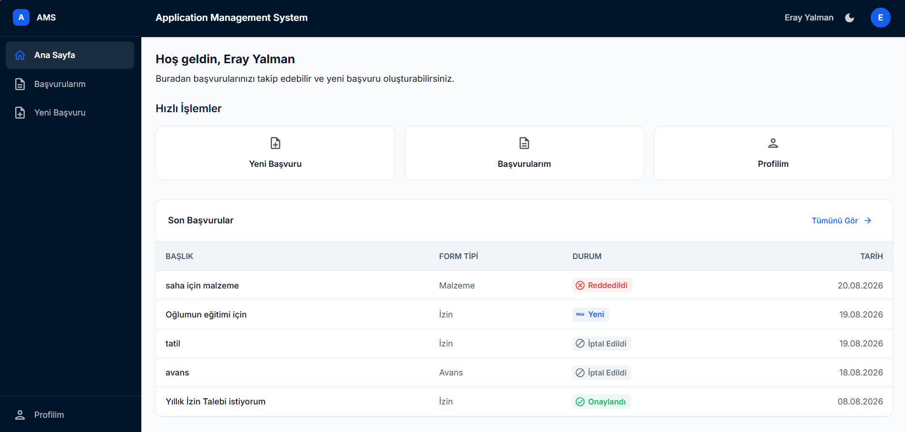 | 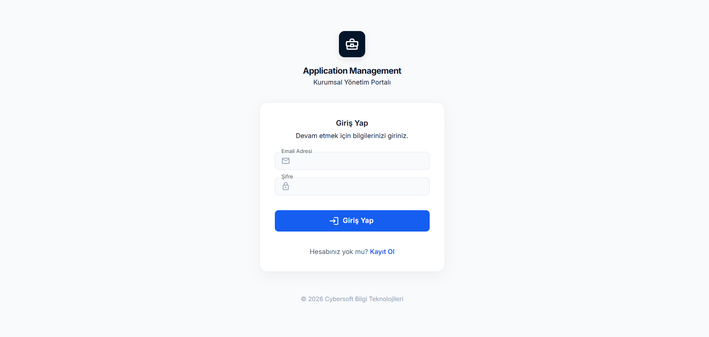<br/>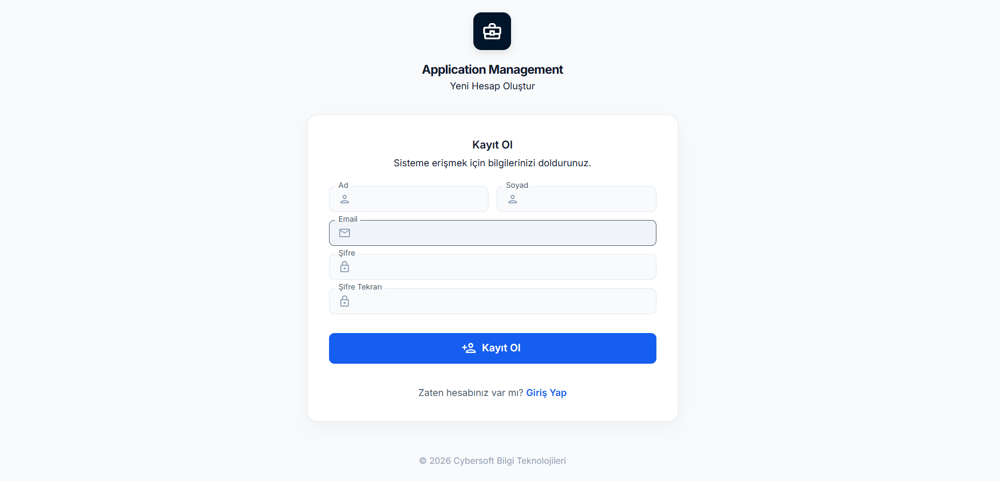 |

| 📝 Applications | 🛠️ Administration |
|---|---|
| 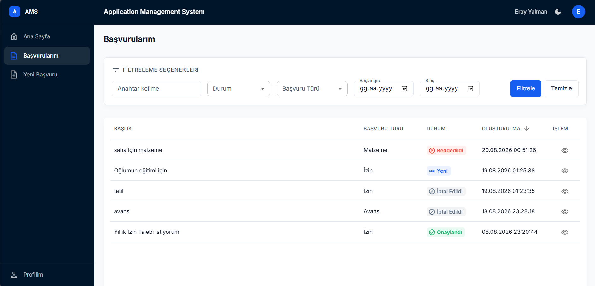<br/>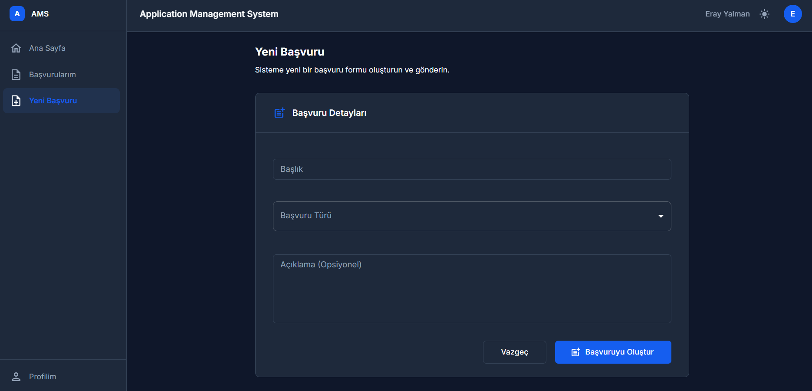<br/>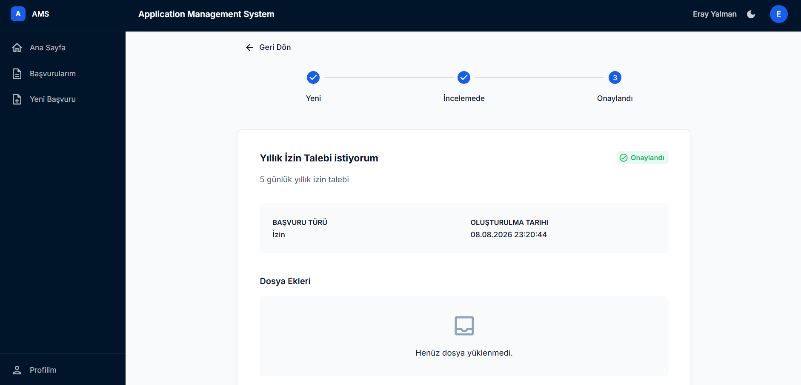 | 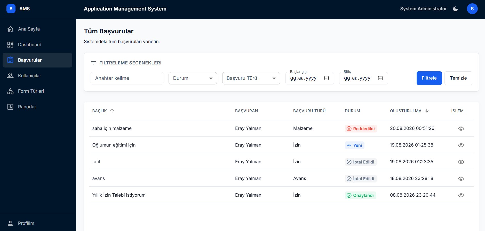<br/>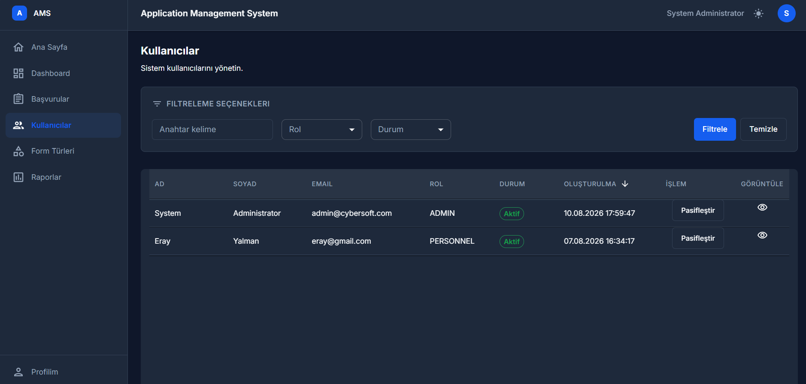<br/>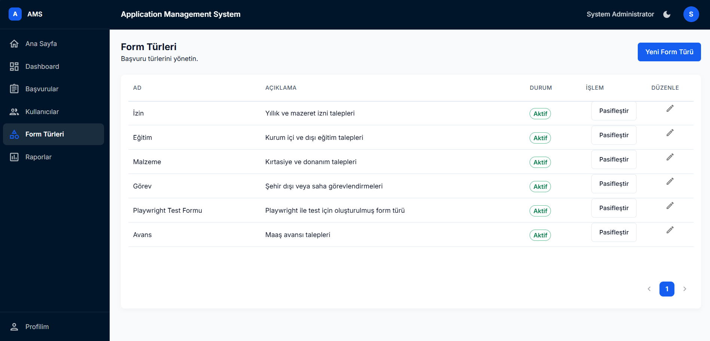 |

| 👤 Profile | |
|---|---|
| 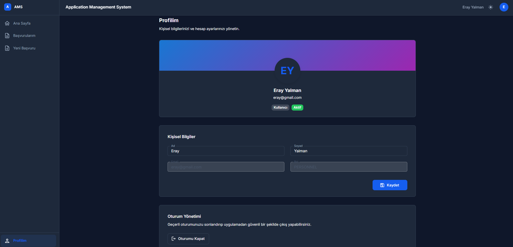 | |

---

<a id="roadmap"></a>
## 🗺️ Roadmap

**✅ Completed:**
- [x] Backend REST API (Spring Boot 3.5)
- [x] JWT authentication with refresh token rotation
- [x] Role-based authorization (ADMIN, PERSONNEL)
- [x] Application workflow with 5 statuses and enforced transitions
- [x] File attachment management
- [x] Admin dashboard with KPI cards
- [x] Reports with date/status/form-type filters
- [x] User and form type management (CRUD, active/inactive states)
- [x] OpenAPI documentation & TypeScript client generation
- [x] React frontend with feature-based architecture
- [x] Dark/Light mode with custom MUI theme
- [x] Docker Compose deployment with Nginx reverse proxy
- [x] Flyway database migrations (7 versions)
- [x] Scheduled token cleanup and admin auto-initialization
- [x] Landing page

- [x] Dedicated audit logging/history subsystem
- [x] In-app Notification Center
- [x] Real-time notifications using Server-Sent Events (SSE)

**⏳ Planned:**
- [ ] Excel / PDF export
- [ ] Email notifications
- [ ] CI/CD pipeline
- [ ] End-to-end test suite (Playwright)
- [ ] Accessibility test suite (axe-core)

---

<a id="future-improvements"></a>
## 🔮 Future Improvements
- 💬 **Application Comments/Notes**
- 🌍 **Multi-language Support (i18n)**
- ⏱️ **API Rate Limiting**
- ☸️ **Kubernetes Deployment Manifests**
- 🧪 **Broader Integration Test Coverage**

---

<a id="project-information"></a>
## ℹ️ Project Information
Corporate Application and Form Management System developed with Spring Boot and React.

---

<a id="license"></a>
## 📄 License
Developer — [Eray Yalman] (Internship Project, Cybersoft)
This project was developed for educational/internship purposes.
---

<a id="top-tr"></a>
<div align="center">

**🇬🇧 [English](#top-en) &nbsp;|&nbsp; 🇹🇷 [Türkçe](#top-tr)**

</div>

# 🏢 Uygulama Yönetim Sistemi

> Rol tabanlı iş akışı, JWT güvenliği ve uçtan uca Docker dağıtımına sahip kurumsal başvuru ve form yönetim platformu.

<div align="center">


<br/>


[Mimari](#system-architecture-tr) · [Özellikler](#features-tr) · [API](#api-endpoints-tr) · [Veritabanı](#database-tr) · [Docker](#docker--deployment-tr) · [Ekran Görüntüleri](#screenshots-tr) · [Kurulum](#installation-tr)

</div>

---

<div align="center">
  
</div>

---

## 📖 İçindekiler
- [✨ Yeni Neler Var](#yeni-neler-var)
- [🎯 Proje Tanımı](#project-description-tr)
- [💡 Neden Bu Proje?](#why-this-project-tr)
- [✨ Özellikler](#features-tr)
- [🔭 Sistem Genel Bakış](#system-at-a-glance-tr)
- [🏗️ Sistem Mimarisi](#system-architecture-tr)
- [🔄 Başvuru İş Akışı](#application-workflow-tr)
- [🔐 Güvenlik Mimarisi](#security-architecture-tr)
- [📊 Gösterge Paneli & Raporlama](#dashboard--reporting-tr)
- [🎨 UI / UX Vitrini](#ui--ux-showcase-tr)
- [🛠️ Teknolojiler](#technologies-tr)
- [🧠 Temel Teknik Kararlar](#key-technical-decisions-tr)
- [📜 İş Kuralları](#business-rules-tr)
- [🗄️ Veritabanı](#database-tr)
- [🔌 API Sözleşmesi & OpenAPI](#api-contract--openapi-tr)
- [🌐 API Endpoint'leri](#api-endpoints-tr)
- [📂 Proje Yapısı](#project-structure-tr)
- [🐳 Docker & Dağıtım](#docker--deployment-tr)
- [🧪 Test & Kalite](#testing--quality-tr)
- [🚀 Kurulum](#installation-tr)
- [⚙️ Ortam Değişkenleri](#environment-variables-tr)
- [📸 Ekran Görüntüleri](#screenshots-tr)
- [🗺️ Yol Haritası](#roadmap-tr)
- [🔮 Gelecek İyileştirmeler](#future-improvements-tr)
- [ℹ️ Proje Bilgisi](#project-information-tr)
- [📄 Lisans](#license-tr)

---

<a id="yeni-neler-var"></a>
## ✨ Yeni Neler Var

Kemerlerinizi bağlayın! Hayatınızı (ve iş akışınızı) inanılmaz kolaylaştıracak yepyeni iki bombayla karşınızdayız.

### 🕵️ Denetim İzi (Audit Log) & Geçmiş
Hiç "Bunu kim onayladı yahu?!" veya "Bu başvuru ne ara reddedildi?" diye düşündüğünüz oldu mu? Artık düşünmeyeceksiniz! **Denetim İzi (Audit Log) Alt Sistemi** her şeyi tek tek not almak için burada.

> [!TIP]
> **Temel Yetenekler:**
> - 🔍 **Tam Denetim İzi:** Bir başvuru üzerinde gerçekleştirilen her durum geçişini ve güncellemeyi otomatik olarak kaydeder. Kaçış yok!
> - ⏱️ **Kronolojik Takip:** İzlenebilirliği sağlamak amacıyla tüm geçmiş olaylar için saniyesine kadar zaman damgalarını yakalar.
> - 👤 **İşlem Sorumluluğu:** İşlemi yapanın kimliğini kaydeder. Artık "ben yapmadım sistem yapmış" devri bitti.
> - 📊 **Merkezi Zaman Çizelgesi:** Başvurunun tüm yaşam döngüsünü, okuması keyifli bir zaman çizelgesi (timeline) olarak sunar. Şirket içi dedikodu okur gibi başvuru geçmişi okuyabilirsiniz!

### 🔔 Gerçek Zamanlı Bildirimler & Bildirim Merkezi
"Acaba onaylandı mı?" diye sayfayı sürekli yenileme (F5) eziyetine son! Karşınızda gerçek zamanlı (SSE) **Uygulama İçi Bildirim Merkezi**.

> [!TIP]
> **Temel Yetenekler:**
> - ⚡ **Anında Haberiniz Olsun:** Bir şeyler olduğunda anında sağ alttan şık bir bildirim gelir. O kadar pürüzsüz ki gözünüz sürekli bildirim arayacak.
> - 📥 **Bildirim Merkezi:** Tüm uyarılarınızı tek bir yerden, son derece kurumsal ve havalı bir arayüzden yönetin.
> - 🧹 **Tertemiz Bir Sayfa:** Tek tıkla "Tümünü okundu işaretle" veya "Tümünü sil" deyin, kafanız rahat etsin!

---

<a id="project-description-tr"></a>
## 🎯 Proje Tanımı

Kurumlarda izin, eğitim, avans, malzeme ve görevlendirme talepleri çoğunlukla dağınık e-posta yazışmaları, Excel tabloları veya sözlü iletişim yoluyla yönetilir. Bu geleneksel yaklaşım merkezi bir takip imkânı sunmaz ve net bir denetim izi (audit trail) tutmayı zorlaştırır.

**Uygulama Yönetim Sistemi**, personelin başvuru oluşturup takip edebildiği, yöneticilerin ise bu başvuruları inceleyip onaylayabildiği/reddedebildiği ve raporlayabildiği web tabanlı bir platformdur. Çeşitli form tiplerini, durum yaşam döngüsünü, dosya eklerini ve analitik gösterge panelini destekleyen bir iş akışı sunar.

---

<a id="why-this-project-tr"></a>
## 💡 Neden Bu Proje?

- Dağınık e-posta/Excel taleplerini merkezi bir dijital iş akışıyla değiştirir.
- Açık bir onay yaşam döngüsüyle (`NEW` → `IN_REVIEW` → `APPROVED` / `REJECTED`) net bir denetim izi sağlar.
- Rol tabanlı JWT kimlik doğrulaması kullanarak başvuru verilerini güvence altına alır.
- Gösterge paneli KPI'ları ve analitik özetlerle raporlamayı otomatikleştirir.
- Başvurulara ait dosya eklerinin yönetimini kolaylaştırır.

---

<a id="system-at-a-glance-tr"></a>
## 🔭 Sistem Genel Bakış

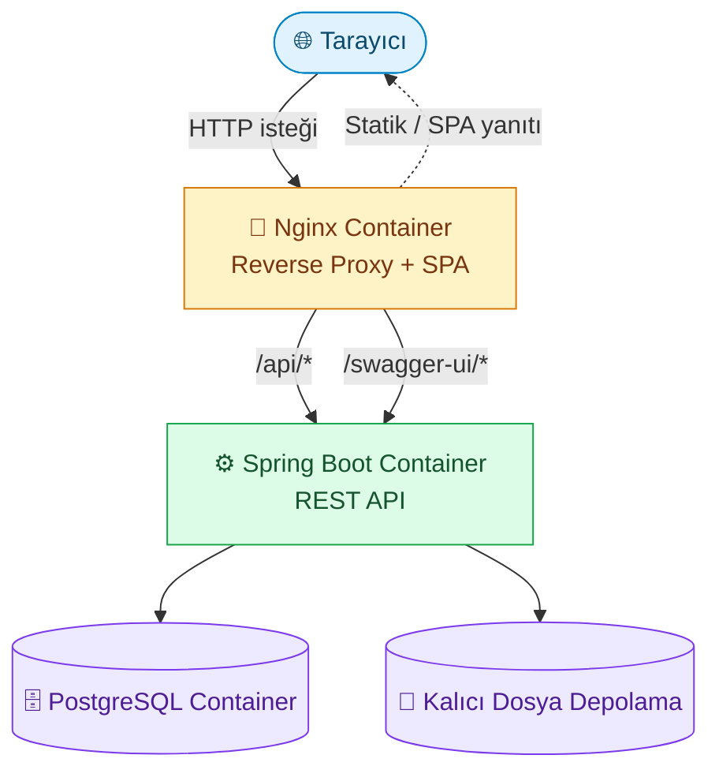
```mermaid
flowchart TD
    Browser(["🌐 Tarayıcı"])
    Nginx["🧭 Nginx Container<br/>Reverse Proxy + SPA"]
    Backend["⚙️ Spring Boot Container<br/>REST API"]
    DB[("🗄️ PostgreSQL Container")]
    Storage[("📁 Kalıcı Dosya Depolama")]

    Browser -->|"HTTP isteği"| Nginx
    Nginx -.->|"Statik / SPA yanıtı"| Browser
    Nginx -->|"/api/*"| Backend
    Nginx -->|"/swagger-ui/*"| Backend
    Backend --> DB
    Backend --> Storage

    classDef client fill:#E0F2FE,stroke:#0284C7,color:#0C4A6E,stroke-width:1px
    classDef proxy fill:#FEF3C7,stroke:#D97706,color:#78350F,stroke-width:1px
    classDef service fill:#DCFCE7,stroke:#16A34A,color:#14532D,stroke-width:1px
    classDef data fill:#EDE9FE,stroke:#7C3AED,color:#4C1D95,stroke-width:1px

    class Browser client
    class Nginx proxy
    class Backend service
    class DB,Storage data
```

> Her üç servis de Docker Compose ile orkestre edilen Docker container'ları olarak çalışır.

---

<a id="system-architecture-tr"></a>
## 🏗️ Sistem Mimarisi

<div align="center">
  
</div>

> Genel mimariyi, varlık ilişkilerini ve istek/yanıt akışını gösteren sistem tasarım beyaz tahtası. ([Kaynak Excalidraw dosyası](docs/architecture/system-design.excalidraw))

---

<a id="features-tr"></a>
## ✨ Özellikler

### 👤 Personel Özellikleri
- E-posta doğrulama ve özel şifre kurallarıyla (`@ValidPassword`) kayıt olma
- Giriş → erişim jetonu (access token) + yenileme jetonu (refresh token) çifti
- **Oturum geri yükleme:** Sayfa yenilendiğinde, `sessionStorage`'daki mevcut erişim jetonu `GET /users/me` çağrısıyla kullanıcı durumunu geri yüklemek için kullanılır
- **Otomatik erişim jetonu yenileme:** 401 yanıtı alındığında Axios interceptor, `POST /auth/refresh-token` üzerinden jetonları rotasyonla (eski jeton geçersiz kılınır, yeni çift verilir) şeffaf şekilde yeniler
- Başvuru oluşturma (başlık, açıklama, form tipi seçimi)
- Kendi başvurularını görüntüleme — sayfalanmış, sıralanmış, filtrelenmiş (Specification pattern)
- Ek dosyalarla birlikte başvuru detayını görüntüleme
- Başvuruları düzenleme (yalnızca `NEW` durumundayken)
- Başvuruları iptal etme (`NEW` veya `IN_REVIEW` durumundan)
- Başvuruları silme (yalnızca `NEW` durumundayken)
- Dosya eki yükleme, indirme ve silme
- Profil görüntüleme ve güncelleme
- Sunucu taraflı refresh token iptaliyle çıkış yapma

### 🛡️ Yönetici Özellikleri
- KPI kartlarıyla gösterge paneli: toplam, bekleyen, onaylanan, reddedilen, iptal edilen, bugünkü sayı
- Gösterge panosunda son başvurular listesi
- Tüm başvuruları görüntüleme — sayfalanmış, sıralanmış, filtrelenmiş
- Başvuruyu incelemeye alma (`NEW` → `IN_REVIEW`)
- Başvuruyu onaylama (`IN_REVIEW` → `APPROVED`)
- Başvuruyu reddetme (`IN_REVIEW` → `REJECTED`)
- Kullanıcı yönetimi — listeleme, arama, detay görüntüleme
- Kullanıcıları aktif/pasif hale getirme
- Kullanıcı bilgilerini güncelleme
- Form tipi CRUD işlemleri — oluşturma, güncelleme, aktif/pasif hale getirme
- Tarih aralığı, durum ve form tipi filtreli raporlar
- Durum dağılımı ve form tipi dağılımı analitikleri

### 🔐 Güvenlik Özellikleri
- JWT erişim jetonları + yenileme jetonları
- SHA-256 ile hash'lenmiş, veritabanında saklanan refresh token
- Refresh token rotasyonu — kullanılan jeton silinir, yeni çift verilir
- BCrypt şifre hash'leme (cost factor 12)
- Durumsuz (stateless) oturumlar (`SessionCreationPolicy.STATELESS`)
- `@PreAuthorize` ile metot düzeyinde güvenlik
- Özel `JwtAuthenticationEntryPoint` (yapılandırılmış 401 JSON)
- Özel `JwtAccessDeniedHandler` (yapılandırılmış 403 JSON)
- `sessionStorage`'da saklanan jeton (sekme kapanınca temizlenir)
- Süresi dolmuş/iptal edilmiş jetonlar için zamanlanmış temizlik (günlük cron)
- Geliştirme ve Docker ortamları için CORS yapılandırması
- Özel `@ValidPassword` kısıt (constraint) anotasyonu + doğrulayıcı

### 🛠️ Platform Özellikleri
- Genel hata yönetimi (`@RestControllerAdvice` + 20'den fazla girdi içeren tipli `ErrorCode` enum'u)
- Bean Validation (`jakarta.validation`)
- Flyway şema migrasyonları (7 sürüm, şema için tek doğruluk kaynağı)
- Hibernate `validate` modu (şema otomatik oluşturulmaz)
- MapStruct DTO eşleme (5 mapper)
- Dinamik, tip güvenli arama için Specification pattern
- Swagger UI ile OpenAPI dokümantasyonu
- OpenAPI'den üretilen TypeScript Axios istemcisi
- Uygulama İçi Bildirim Merkezi (Notification Center)
- SSE (Server-Sent Events) ile gerçek zamanlı bildirimler
- Spring Boot Actuator
- Docker Compose (3 servis, healthcheck, 2 kalıcı volume)
- Nginx reverse proxy (SPA fallback + API/Swagger proxy + statik varlık önbellekleme)
- Çok aşamalı Dockerfile'lar (Node 22 build + Nginx runtime, Maven + Temurin 21 runtime)
- Material UI bileşen kütüphanesiyle duyarlı (responsive) arayüz
- Karanlık / Aydınlık mod (özel tasarım token'larına sahip ThemeContext)
- `@fontsource/inter` ile Inter font ailesi
- Landing page (tanıtım sayfası)
- İlk başlatmada otomatik admin kullanıcı oluşturma (`AdminInitializer`)

---

<a id="application-workflow-tr"></a>
## 🔄 Başvuru İş Akışı

**Doğrulanmış geçişler** (`ApplicationValidator` + `ApplicationFormServiceImpl`'den):

```text
NEW        → IN_REVIEW   (Admin: moveToReview)
NEW        → CANCELLED   (Personnel: cancel)
IN_REVIEW  → APPROVED    (Admin: approve)
IN_REVIEW  → REJECTED    (Admin: reject)
IN_REVIEW  → CANCELLED   (Personnel: cancel)
APPROVED   → (terminal)
REJECTED   → (terminal)
CANCELLED  → (terminal)
```

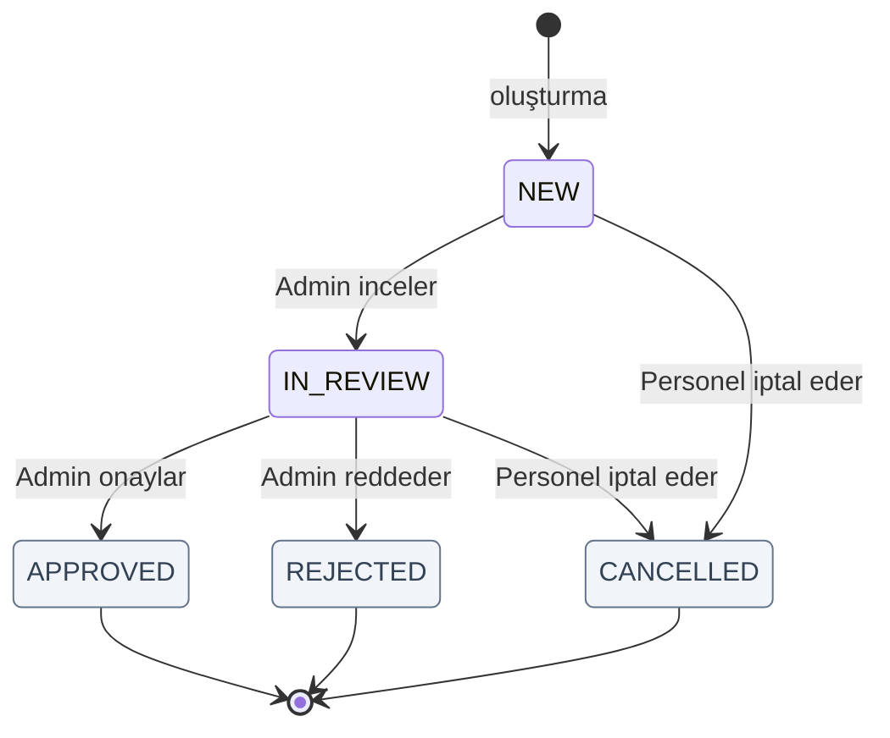
```mermaid
stateDiagram-v2
    [*] --> NEW : oluşturma

    NEW --> IN_REVIEW : Admin inceler
    NEW --> CANCELLED : Personel iptal eder

    IN_REVIEW --> APPROVED : Admin onaylar
    IN_REVIEW --> REJECTED : Admin reddeder
    IN_REVIEW --> CANCELLED : Personel iptal eder

    APPROVED --> [*]
    REJECTED --> [*]
    CANCELLED --> [*]

    classDef terminal fill:#F1F5F9,stroke:#64748B,color:#334155
    class APPROVED,REJECTED,CANCELLED terminal
```

| Durum | 📄 Açıklama | 👤 Tetikleyen | 🔀 İzin Verilen Geçişler |
|---|---|---|---|
| `NEW` | Yeni oluşturulmuş başvuru | Sistem (oluşturmada) | → `IN_REVIEW`, → `CANCELLED` |
| `IN_REVIEW` | Admin değerlendirmesinde | Admin | → `APPROVED`, → `REJECTED`, → `CANCELLED` |
| `APPROVED` | Admin tarafından onaylandı | Admin | *Nihai (terminal) — başka geçiş yok* |
| `REJECTED` | Admin tarafından reddedildi | Admin | *Nihai (terminal) — başka geçiş yok* |
| `CANCELLED` | Başvuru sahibi tarafından iptal edildi | Personel | *Nihai (terminal) — başka geçiş yok* |

---

<a id="security-architecture-tr"></a>
## 🔐 Güvenlik Mimarisi

- Spring Security filtre zinciri yapılandırması (stateless)
- Her istekte çalışan `JwtAuthenticationFilter`
- jjwt kütüphanesiyle JWT (erişim + yenileme jetonları)
- Refresh token: SHA-256 ile hash'lenir, DB'de saklanır, kullanılınca silinir (rotasyon)
- BCrypt şifre encoding (cost factor 12)
- Controller endpoint'lerinde `@EnableMethodSecurity` + `@PreAuthorize`
- Özel 401/403 JSON hata işleyicileri
- Auth endpoint'leri herkese açık, diğer tüm endpoint'ler kimlik doğrulama gerektirir
- İstemci tarafı jeton saklama için `sessionStorage` (`localStorage` değil)
- Zamanlanmış jeton temizliği (`RefreshTokenCleanupScheduler`, cron `0 30 3 * * *`)

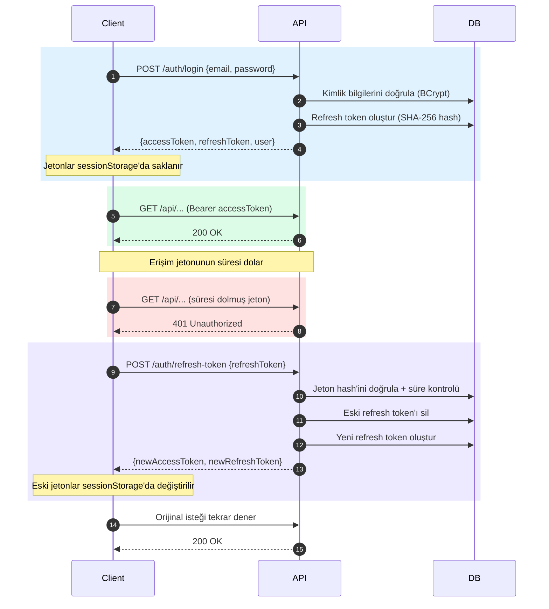
```mermaid
sequenceDiagram
    autonumber
    participant Client
    participant API
    participant DB

    rect rgb(224, 242, 254)
    Client->>API: POST /auth/login {email, password}
    API->>DB: Kimlik bilgilerini doğrula (BCrypt)
    API->>DB: Refresh token oluştur (SHA-256 hash)
    API-->>Client: {accessToken, refreshToken, user}
    Note over Client: Jetonlar sessionStorage'da saklanır
    end

    rect rgb(220, 252, 231)
    Client->>API: GET /api/... (Bearer accessToken)
    API-->>Client: 200 OK
    end

    Note over Client,API: Erişim jetonunun süresi dolar

    rect rgb(254, 226, 226)
    Client->>API: GET /api/... (süresi dolmuş jeton)
    API-->>Client: 401 Unauthorized
    end

    rect rgb(237, 233, 254)
    Client->>API: POST /auth/refresh-token {refreshToken}
    API->>DB: Jeton hash'ini doğrula + süre kontrolü
    API->>DB: Eski refresh token'ı sil
    API->>DB: Yeni refresh token oluştur
    API-->>Client: {newAccessToken, newRefreshToken}
    Note over Client: Eski jetonlar sessionStorage'da değiştirilir
    end

    Client->>API: Orijinal isteği tekrar dener
    API-->>Client: 200 OK
```

> [!IMPORTANT]
> **Oturum Geri Yükleme vs. Otomatik Jeton Yenileme**
> - **Oturum Geri Yükleme** — Sayfa yenilendiğinde uygulama `sessionStorage`'da mevcut bir erişim jetonu olup olmadığını kontrol eder ve kimlik bilgisi tekrar girmeden kullanıcı profilini geri yüklemek için `GET /users/me` çağırır.
> - **Otomatik Jeton Yenileme** — Bir API çağrısı 401 yanıtı aldığında, Axios interceptor `/auth/refresh-token`'ı şeffaf şekilde çağırır, her iki jetonu da `sessionStorage`'da değiştirir (rotasyon) ve başarısız isteği tekrar dener. Eşzamanlı istekler yenileme sırasında kuyruğa alınır.

---

<a id="dashboard--reporting-tr"></a>
## 📊 Gösterge Paneli & Raporlama

Gösterge paneli ve raporlama modülleri, **Recharts** (pasta grafikler, çubuk grafikler) kullanarak gerçek zamanlı metrikler ve analitikler sunar.

**📈 Gösterge Paneli KPI'ları** (`DashboardResponse`'dan):
- Toplam başvuru sayısı
- Bekleyen başvurular (`NEW` + `IN_REVIEW`)
- Onaylanan / Reddedilen / İptal edilen sayıları
- Bugünkü başvurular
- Son başvurular listesi

**📋 Raporlar** (`ApplicationReportResponse`'dan):
- Tarih aralığı filtresi (başlangıç, bitiş)
- Durum filtresi
- Form tipi filtresi
- KPI dökümü: toplam, yeni, incelemede, onaylanan, reddedilen, iptal edilen
- Form tipi dağılımı (`applicationsByFormType`)

<div align="center">
  
  
</div>

---

<a id="ui--ux-showcase-tr"></a>
## 🎨 UI / UX Vitrini

Frontend, hem aydınlık hem karanlık paletler için özel tasarım token'ları tanımlayan kapsamlı bir özel tema (`theme.ts` — 290 satır) kullanan sağlam **Material UI v9** tasarım sistemini kullanır.

**Öne çıkanlar:**
- 🧩 Daraltılabilir `AppSidebar` + `AppHeader` içeren duyarlı `AppLayout`
- 🌓 `ThemeContext` üzerinden sorunsuz Karanlık/Aydınlık mod geçişi
- ✒️ `@fontsource/inter` ile net tipografi

| ☀️ Aydınlık Mod | 🌙 Karanlık Mod |
|---|---|
|  |  |

---

<a id="technologies-tr"></a>
## 🛠️ Teknolojiler

### ⚙️ Backend
| Teknoloji | Sürüm | Amaç |
|---|---|---|
| **Java** | 21 | Çalışma zamanı platformu |
| **Spring Boot** | 3.5.16 | Uygulama framework'ü |
| **Spring Security** | Managed | Kimlik doğrulama & yetkilendirme |
| **Spring Data JPA** | Managed | Veri erişim katmanı |
| **Hibernate** | Managed | ORM — `validate` modu |
| **PostgreSQL** | 16 | İlişkisel veritabanı |
| **Flyway** | Managed | Veritabanı şema migrasyonu |
| **JWT (jjwt)** | 0.12.7 | Jeton tabanlı kimlik doğrulama |
| **MapStruct** | 1.6.3 | Derleme zamanı DTO ↔ Entity eşleme |
| **Lombok** | 1.18.46 | Boilerplate azaltma |
| **SpringDoc OpenAPI** | 2.8.9 | API dokümantasyonu & Swagger UI |
| **Bean Validation** | Managed | İstek doğrulama |
| **Spring Boot Actuator** | Managed | Uygulama izleme endpoint'leri |
| **Maven** | Wrapper | Build & bağımlılık yönetimi |

### ⚛️ Frontend
| Teknoloji | Sürüm | Amaç |
|---|---|---|
| **React** | 19 | UI kütüphanesi |
| **TypeScript** | 6 | Tip güvenli geliştirme |
| **Vite** | 8 | Build aracı & dev server |
| **Material UI (MUI)** | 9 | Bileşen kütüphanesi |
| **MUI X Data Grid** | 9 | Sıralama, filtreleme, sayfalamalı gelişmiş veri tabloları |
| **React Router** | 7 | İstemci taraflı yönlendirme |
| **TanStack Query** | 5 | Sunucu durumu yönetimi & önbellekleme |
| **Axios** | 1.19 | Interceptor'lı HTTP istemcisi |
| **React Hook Form** | 7 | Form durumu yönetimi |
| **Zod** | 4 | Şema doğrulama |
| **Recharts** | 3 | Veri görselleştirme (grafikler) |
| **Emotion** | 11 | CSS-in-JS stil motoru (MUI) |
| **Inter (Fontsource)** | 5 | Tipografi |

### ☁️ Altyapı
| Teknoloji | Sürüm | Amaç |
|---|---|---|
| **Docker** | — | Container'laştırma |
| **Docker Compose** | — | Çoklu container orkestrasyonu |
| **Nginx** | 1.27-alpine | Reverse proxy, SPA sunumu, statik önbellekleme |
| **Node** | 22-alpine | Frontend build aşaması |
| **Maven** | 3.9 + Temurin 21 | Backend build aşaması |
| **Eclipse Temurin** | 21-jre-alpine | Backend çalışma zamanı |

---

<a id="key-technical-decisions-tr"></a>
## 🧠 Temel Teknik Kararlar

1. **DTO + MapStruct** — Entity'ler asla API'ye dışa açılmaz; derleme zamanı mapper'lar, çalışma zamanı reflection maliyetini önler.
2. **Specification Pattern** — `ApplicationFormSpecification`, `UserSpecification` → ham SQL olmadan dinamik, tip güvenli, birleştirilebilir sorgular.
3. **JWT + Refresh Token Rotasyonu** — Sunucu taraflı oturum olmadan stateless kimlik doğrulama. Kullanılan refresh token'lar silinir → jeton hırsızlığı riskini azaltır.
4. **SHA-256 Jeton Hash'leme** — Ham refresh token'lar asla veritabanında saklanmaz; yalnızca hash'leri tutulur.
5. **Flyway + Hibernate validate** — Şema için tek doğruluk kaynağı Flyway migrasyonlarıdır. Hibernate yalnızca entity eşlemesini mevcut şemaya göre doğrular.
6. **`localStorage` yerine `sessionStorage`** — Sekme/tarayıcı kapanınca jetonlar otomatik temizlenir → XSS ile jeton hırsızlığı riskini azaltır.
7. **Genel Hata Yönetimi** — `@RestControllerAdvice` + tipli `ErrorCode` enum'u → tüm endpoint'lerde tutarlı, makine tarafından okunabilir hata yanıtları.
8. **API İstemci Üretimi** — OpenAPI'den üretilen TypeScript Axios istemcisi düşük seviyeli API sözleşmesini yönetirken, frontend servis sarmalayıcıları ve hook'lar uygulama seviyesinde soyutlama sağlar.
9. **Docker + Nginx Reverse Proxy** — Tek kaynaklı (single-origin) dağıtım. SPA fallback + `/api/*` proxy → üretimde CORS gerekmez.
10. **Özellik Bazlı (Feature-based) Frontend Mimarisi** — API, hook, sayfa ve şemaların bir arada bulunduğu domain odaklı dizin yapısı (`features/applications/`, `features/auth/`, vb.).
11. **TanStack Query** — Sunucu durumu önbellekleme, arka planda yeniden veri çekme, mutation bazlı önbellek geçersiz kılma. API verisi için manuel durum yönetimi yok.
12. **Kalıcı Docker Volume'leri** — `postgres_data` + `app_storage`, container yeniden oluşturulsa bile kalıcıdır.
13. **Admin Otomatik Başlatma** — `CommandLineRunner`, ilk başlatmada ortam değişkenlerinden admin kullanıcı oluşturur.
14. **Zamanlanmış Jeton Temizliği** — Günlük cron işi, süresi dolmuş/iptal edilmiş refresh token'ları veritabanından temizler.
15. **Denetim Günlüğü (Audit Log) vs. Bildirimler** — Denetim günlükleri sistem geçmişini uyumluluk için kaydederken, bildirim alt sistemi kullanıcıları ilgili olaylardan anında haberdar eder.
16. **Gerçek Zamanlı Bildirimler (SSE)** — İstemciye tek yönlü gerçek zamanlı veri akışı için karmaşık WebSocket yerine Server-Sent Events (SSE) tercih edilmiştir.
17. **Bildirim Kalıcılığı** — Bildirimler yetkilendirilmiş kullanıcıya özel olarak PostgreSQL'de saklanır; yönetim (REST) ile dağıtım (SSE) ayrıştırılmıştır.

---

<a id="business-rules-tr"></a>
## 📜 İş Kuralları

| ⚖️ Kural | 🔒 Uygulayan |
|---|---|
| Personel yalnızca kendi başvurularını görüntüleyebilir | `ApplicationValidator.validateAccess()` |
| Admin tüm başvuruları görüntüleyebilir | `getAllApplications` üzerinde `@PreAuthorize("hasRole('ADMIN')")` |
| Yalnızca `NEW` başvurular düzenlenebilir | `ApplicationValidator.validateUpdatable()` |
| Yalnızca `NEW` başvurular silinebilir | `ApplicationValidator.validateDeletable()` |
| Yalnızca `NEW` başvurular incelemeye alınabilir | `ApplicationValidator.validateReviewable()` |
| Yalnızca `IN_REVIEW` başvurular onaylanabilir | `ApplicationValidator.validateApprovable()` |
| Yalnızca `IN_REVIEW` başvurular reddedilebilir | `ApplicationValidator.validateRejectable()` |
| İptal `NEW` veya `IN_REVIEW`'dan yapılabilir | `ApplicationValidator.validateCancellable()` |
| `APPROVED`, `REJECTED`, `CANCELLED` nihaidir (terminal) | `ApplicationStatusValidator` ALLOWED_TRANSITIONS → boş küme |
| Pasif form tipleri yeni başvurularda kullanılamaz | `ApplicationFormServiceImpl.create()` → `InactiveFormTypeException` |
| Pasif form tipleri düzenlemede kullanılamaz | `ApplicationFormServiceImpl.updateApplicationForm()` → `InactiveFormTypeException` |
| Yinelenen e-posta kaydı engellenir | DB unique constraint `uq_users_email` + `ErrorCode.EMAIL_ALREADY_EXISTS` |
| Yinelenen form tipi adı engellenir | DB unique constraint `uq_form_types_name` + `ErrorCode.FORM_TYPE_ALREADY_EXISTS` |
| Zaten aktif kullanıcı tekrar aktif edilemez | `UserValidator.validateActivation()` |
| Zaten pasif kullanıcı tekrar pasif edilemez | `UserValidator.validateDeactivation()` |
| Kullanılan refresh token silinir (rotasyon) | `RefreshTokenServiceImpl` — eskisini sil, yenisini oluştur |
| Süresi dolmuş / iptal edilmiş jetonlar reddedilir | `RefreshTokenServiceImpl.validate()` |
| Yükleme için dosya tipi ve boyut kısıtlamaları | `ErrorCode.INVALID_FILE_TYPE`, `ErrorCode.FILE_SIZE_EXCEEDED` |

---

<a id="database-tr"></a>
## 🗄️ Veritabanı

**7 Tablo (Flyway V1–V9):**

| Tablo | Migrasyon | Amaç | Temel Kısıtlar |
|---|---|---|---|
| `users` | V1 | Kullanıcı hesapları | PK UUID, UNIQUE email, CHECK role IN ('ADMIN','PERSONNEL'), `is_active` |
| `form_types` | V2 | Başvuru kategorileri | PK UUID, UNIQUE name, `is_active` |
| `application_forms` | V3 | Gönderilen başvurular | FK → users (`RESTRICT`), FK → form_types (`RESTRICT`), CHECK status |
| `attachments` | V4 | Yüklenen dosyalar | FK → application_forms (`CASCADE`) |
| `refresh_tokens` | V7 | JWT yenileme jetonları | FK → users (`CASCADE`), UNIQUE token_hash, `revoked`, `expires_at` |
| `application_audit_logs` | V8 | Denetim günlüğü | FK → application_forms, FK → users |
| `notifications` | V9 | Kullanıcı bildirimleri | FK → users, `is_read` |

**İndeksler (V6 + V7):**
- `idx_application_forms_user_id`
- `idx_application_forms_form_type_id`
- `idx_application_forms_status`
- `idx_attachments_application_form_id`
- `idx_refresh_tokens_user_id`
- `idx_refresh_tokens_expires_at`

**Seed veri (V5):** 5 varsayılan form tipi — İzin, Eğitim, Avans, Malzeme, Görev

> [!TIP]
> **Tasarım Kararları:**
> - UUID birincil anahtarlar (`gen_random_uuid()`)
> - Tüm zaman damgaları için `TIMESTAMPTZ`
> - Kullanıcılar ve form tiplerinde `is_active` ile soft-active durumu
> - Referans bütünlüğü için `ON DELETE RESTRICT` (users, form_types)
> - Alt veri temizliği için `ON DELETE CASCADE` (attachments, refresh_tokens)
> - Enum kolonları için CHECK kısıtları
> - Sık sorgulanan foreign key ve filtre kolonlarında indeksler

<div align="center">
  
</div>

> [!IMPORTANT]
> `docs/architecture/db-schema.png` dosyasının en güncel migrasyonu (V7'de eklenen `refresh_tokens` tablosu dahil) yansıttığından emin olun.

---

<a id="api-contract--openapi-tr"></a>
## 🔌 API Sözleşmesi & OpenAPI

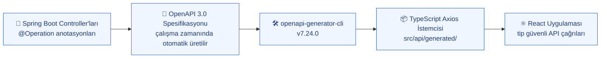
```mermaid
flowchart LR
    A["🧩 Spring Boot Controller'ları<br/>@Operation anotasyonları"] --> B["📄 OpenAPI 3.0 Spesifikasyonu<br/>çalışma zamanında otomatik üretilir"]
    B --> C["🛠️ openapi-generator-cli<br/>v7.24.0"]
    C --> D["📦 TypeScript Axios İstemcisi<br/>src/api/generated/"]
    D --> E["⚛️ React Uygulaması<br/>tip güvenli API çağrıları"]

    classDef step fill:#EFF6FF,stroke:#2563EB,color:#1E3A8A,stroke-width:1px
    class A,B,C,D,E step
```

**Notlar:**
- Üretilen istemci `src/api/generated/` altında (134KB `api.ts`)
- Üretilen dosyalar repoya commit edilir; manuel düzenleme önerilmez
- Backend API değiştiğinde yeniden üretilmeli
- Swagger UI: `http://localhost:3000/swagger-ui/index.html` (Docker) veya `http://localhost:8080/swagger-ui.html` (dev)

---

<a id="api-endpoints-tr"></a>
## 🌐 API Endpoint'leri

**41 REST endpoint'leri**

### 🔐 Kimlik Doğrulama
| Metot | Endpoint | Açıklama | Yetki |
|---|---|---|---|
| 🟢 `POST` | `/api/v1/auth/register` | Yeni kullanıcı kaydı | Public |
| 🟢 `POST` | `/api/v1/auth/login` | Kullanıcı kimlik doğrulama | Public |
| 🟢 `POST` | `/api/v1/auth/refresh-token` | Erişim jetonunu yenile | Public |
| 🟢 `POST` | `/api/v1/auth/logout` | Refresh token'ı iptal et | Public |

### 👥 Kullanıcılar
| Metot | Endpoint | Açıklama | Yetki |
|---|---|---|---|
| 🔵 `GET` | `/api/v1/users/me` | Mevcut kullanıcı profilini getir | Authenticated |
| 🟠 `PUT` | `/api/v1/users/me` | Kendi profilini güncelle | Authenticated |
| 🔵 `GET` | `/api/v1/users/all` | Tüm kullanıcıları listele (sayfalanmış, aranabilir) | `ADMIN` |
| 🔵 `GET` | `/api/v1/users/{userId}` | ID'ye göre kullanıcı getir | `ADMIN` |
| 🟠 `PUT` | `/api/v1/users/{userId}/update` | Kullanıcıyı güncelle | `ADMIN` |
| 🟡 `PATCH` | `/api/v1/users/{userId}/activate` | Kullanıcıyı aktif et | `ADMIN` |
| 🟡 `PATCH` | `/api/v1/users/{userId}/deactivate` | Kullanıcıyı pasif et | `ADMIN` |

### 📝 Başvurular
| Metot | Endpoint | Açıklama | Yetki |
|---|---|---|---|
| 🟢 `POST` | `/api/v1/applications/create` | Başvuru oluştur | `PERSONNEL` |
| 🔵 `GET` | `/api/v1/applications/my` | Kendi başvurularını listele (sayfalanmış, filtreli) | `PERSONNEL` |
| 🔵 `GET` | `/api/v1/applications/all` | Tüm başvuruları listele (sayfalanmış, filtreli) | `ADMIN` |
| 🔵 `GET` | `/api/v1/applications/{id}` | Başvuru detayını getir | `PERSONNEL` / `ADMIN` |
| 🟠 `PUT` | `/api/v1/applications/{id}` | Başvuruyu güncelle (yalnızca NEW) | `PERSONNEL` |
| 🔴 `DELETE` | `/api/v1/applications/{id}` | Başvuruyu sil (yalnızca NEW) | `PERSONNEL` |
| 🟡 `PATCH` | `/api/v1/applications/{id}/cancel` | Başvuruyu iptal et | `PERSONNEL` |
| 🟡 `PATCH` | `/api/v1/applications/{id}/review` | İncelemeye al | `ADMIN` |
| 🟡 `PATCH` | `/api/v1/applications/{id}/approve` | Başvuruyu onayla | `ADMIN` |
| 🟡 `PATCH` | `/api/v1/applications/{id}/reject` | Başvuruyu reddet | `ADMIN` |

### 📎 Ekler
| Metot | Endpoint | Açıklama | Yetki |
|---|---|---|---|
| 🟢 `POST` | `/api/v1/attachments/applications/{id}` | Dosya yükle | `PERSONNEL` / `ADMIN` |
| 🔵 `GET` | `/api/v1/attachments/applications/{id}` | Başvurunun eklerini listele | `PERSONNEL` / `ADMIN` |
| 🔵 `GET` | `/api/v1/attachments/{id}/download` | Dosyayı indir | `PERSONNEL` / `ADMIN` |
| 🔴 `DELETE` | `/api/v1/attachments/{id}` | Eki sil | `PERSONNEL` / `ADMIN` |

### 📁 Form Tipleri
| Metot | Endpoint | Açıklama | Yetki |
|---|---|---|---|
| 🔵 `GET` | `/api/v1/form-types` | Tüm form tiplerini listele | `PERSONNEL` / `ADMIN` |
| 🔵 `GET` | `/api/v1/form-types/{id}` | ID'ye göre form tipi getir | `PERSONNEL` / `ADMIN` |
| 🟢 `POST` | `/api/v1/form-types` | Form tipi oluştur | `ADMIN` |
| 🟠 `PUT` | `/api/v1/form-types/{id}` | Form tipini güncelle | `ADMIN` |
| 🟡 `PATCH` | `/api/v1/form-types/{id}/activate` | Form tipini aktif et | `ADMIN` |
| 🟡 `PATCH` | `/api/v1/form-types/{id}/deactivate` | Form tipini pasif et | `ADMIN` |

### 📈 Gösterge Paneli & Raporlar
| Metot | Endpoint | Açıklama | Yetki |
|---|---|---|---|
| 🔵 `GET` | `/api/v1/dashboard` | Gösterge paneli KPI'larını getir | `ADMIN` |
| 🔵 `GET` | `/api/v1/reports/applications` | Filtrelenmiş başvuru raporu getir | `ADMIN` |

### 🔔 Bildirimler
| Metot | Endpoint | Açıklama | Yetki |
|---|---|---|---|
| 🔵 `GET` | `/api/v1/notifications` | Kullanıcı bildirimlerini listele | `PERSONNEL` / `ADMIN` |
| 🔵 `GET` | `/api/v1/notifications/unread-count` | Okunmamış bildirim sayısını getir | `PERSONNEL` / `ADMIN` |
| 🟡 `PATCH` | `/api/v1/notifications/{notificationId}/read` | Okundu olarak işaretle | `PERSONNEL` / `ADMIN` |
| 🟡 `PATCH` | `/api/v1/notifications/read-all` | Tümünü okundu olarak işaretle | `PERSONNEL` / `ADMIN` |
| 🔴 `DELETE` | `/api/v1/notifications/{notificationId}` | Bildirimi sil | `PERSONNEL` / `ADMIN` |
| 🔴 `DELETE` | `/api/v1/notifications` | Tüm bildirimleri sil | `PERSONNEL` / `ADMIN` |
| 📡 `GET` | `/api/v1/notifications/stream` | Gerçek zamanlı SSE akışı | `PERSONNEL` / `ADMIN` |

---

<a id="project-structure-tr"></a>
## 📂 Proje Yapısı

```text
application-management-system/
├── backend/
│   └── application-management/
│       ├── src/main/java/com/cybersoft/application_management/
│       │   ├── business/           # Durum geçiş kuralları
│       │   ├── config/             # Admin init, JWT config, OpenAPI config
│       │   ├── controller/         # 7 REST controller
│       │   ├── dto/                # Request / Response DTO'ları
│       │   │   ├── request/        #   13 request DTO'su
│       │   │   └── response/       #   10 response DTO'su
│       │   ├── entity/             # 5 JPA entity'si
│       │   ├── enums/              # ApplicationStatus, UserRole
│       │   ├── exception/          # Tipli exception'lar + ErrorCode enum'u
│       │   ├── handler/            # GlobalExceptionHandler
│       │   ├── mapper/             # 5 MapStruct mapper'ı
│       │   ├── repository/         # JPA repository'leri
│       │   │   ├── specification/  #   Dinamik sorgu spesifikasyonları
│       │   │   └── impl/           #   Özel repository implementasyonları
│       │   ├── scheduler/          # Refresh token temizlik cron'u
│       │   ├── security/           # JWT filter, config, handler'lar, UserDetails
│       │   ├── service/            # Servis arayüzleri
│       │   │   ├── impl/           #   8 servis implementasyonu
│       │   │   └── validator/      #   Application & User validator'ları
│       │   ├── storage/            # Dosya depolama soyutlaması
│       │   └── validation/         # Özel @ValidPassword anotasyonu
│       ├── src/main/resources/
│       │   ├── application.yaml
│       │   └── db/migration/       # V1–V7 Flyway migrasyon scriptleri
│       ├── src/test/               # JUnit 5 birim testleri
│       ├── Dockerfile              # Çok aşamalı (Maven build + Temurin runtime)
│       └── pom.xml
├── frontend/
│   ├── src/
│   │   ├── api/
│   │   │   ├── client.ts           # Axios instance + refresh interceptor
│   │   │   ├── config.ts           # API config
│   │   │   └── generated/          # OpenAPI'den üretilen TypeScript istemcisi
│   │   ├── app/
│   │   │   ├── router/             # React Router yapılandırması
│   │   │   ├── providers/          # AppProviders, ThemeContext, QueryClient
│   │   │   └── theme.ts            # MUI teması (aydınlık + karanlık token'lar)
│   │   ├── components/             # Ortak: AppLayout, AppSidebar, AppHeader, StatusChip
│   │   ├── features/
│   │   │   ├── applications/       # Sayfalar, hook'lar, API, bileşenler, şemalar
│   │   │   ├── attachments/        # API, hook'lar
│   │   │   ├── auth/               # Context, guard'lar, sayfalar, şemalar
│   │   │   ├── dashboard/          # Sayfalar, hook'lar, API
│   │   │   ├── form-types/         # Sayfalar, hook'lar, API, bileşenler, şemalar
│   │   │   ├── home/               # Ana sayfa
│   │   │   ├── landing/            # Tanıtım sayfası
│   │   │   ├── profile/            # Sayfalar, hook'lar, API, şemalar
│   │   │   ├── reports/            # Sayfalar, hook'lar, API
│   │   │   └── users/              # Sayfalar, hook'lar, API, bileşenler, şemalar
│   │   └── lib/                    # auth-storage (sessionStorage sarmalayıcısı)
│   ├── Dockerfile                  # Çok aşamalı (Node build + Nginx runtime)
│   ├── nginx.conf                  # Reverse proxy + SPA fallback
│   └── package.json
├── docs/
│   └── architecture/               # Diyagramlar, whiteboard, Excalidraw kaynağı
├── docker-compose.yml
├── .env.example
└── README.md
```

---

<a id="docker--deployment-tr"></a>
## 🐳 Docker & Dağıtım

**3 container:**

| Servis | Temel İmaj | İç Port | Amaç |
|---|---|---|---|
| `postgres` | `postgres:16` | 5432 | Veritabanı |
| `backend` | Çok aşamalı (Maven → Temurin 21 JRE Alpine) | 8080 | Spring Boot REST API |
| `frontend` | Çok aşamalı (Node 22 → Nginx 1.27 Alpine) | 80 | SPA + Reverse Proxy |

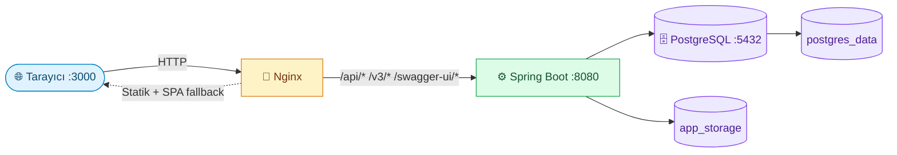
```mermaid
flowchart LR
    Browser(["🌐 Tarayıcı :3000"])
    Nginx["🧭 Nginx"]
    Backend["⚙️ Spring Boot :8080"]
    DB[("🗄️ PostgreSQL :5432")]
    Vol1[("postgres_data")]
    Vol2[("app_storage")]

    Browser -->|"HTTP"| Nginx
    Nginx -.->|"Statik + SPA fallback"| Browser
    Nginx -->|"/api/* /v3/* /swagger-ui/*"| Backend
    Backend --> DB
    Backend --> Vol2
    DB --> Vol1

    classDef client fill:#E0F2FE,stroke:#0284C7,color:#0C4A6E,stroke-width:1px
    classDef proxy fill:#FEF3C7,stroke:#D97706,color:#78350F,stroke-width:1px
    classDef service fill:#DCFCE7,stroke:#16A34A,color:#14532D,stroke-width:1px
    classDef data fill:#EDE9FE,stroke:#7C3AED,color:#4C1D95,stroke-width:1px

    class Browser client
    class Nginx proxy
    class Backend service
    class DB,Vol1,Vol2 data
```

> [!IMPORTANT]
> **Nginx Proxy Kuralları:**
> - `/` → SPA fallback (`try_files $uri $uri/ /index.html`)
> - `/api/*` → `proxy_pass http://backend:8080`
> - `/v3/*` → OpenAPI spec proxy
> - `/swagger-ui/*` → Swagger UI proxy
> - Statik varlıklar (JS, CSS, resim, font) → `expires 1y`, `Cache-Control: public, immutable`

**Kalıcı volume'ler:** `postgres_data`, `app_storage`

**Healthcheck:** PostgreSQL `pg_isready`. Backend yalnızca `condition: service_healthy` sağlandıktan sonra başlar.

---

<a id="testing--quality-tr"></a>
## 🧪 Test & Kalite

### 🔬 Mevcut Testler

| Test | Tip | Kapsam |
|---|---|---|
| `ApplicationManagementApplicationTests` | Spring Boot context testi | Uygulama context'inin doğru yüklendiğini doğrular |
| `ApplicationValidatorTest` | JUnit 5 birim testi (parametreli) | Durum geçiş doğrulamaları: updatable, reviewable, approvable, cancellable |
| `UserValidatorTest` | JUnit 5 birim testi | Aktif/pasif etme durum doğrulamaları |

### 🧰 Mevcut Araçlar (kurulu, test dosyası yazılmamış)

| Araç | Amaç | Durum |
|---|---|---|
| **Playwright** (`^1.62.1`) | Uçtan uca tarayıcı testi | Dev bağımlılığı kurulu; **test dosyası yok** |
| **axe-core** (`^4.13.0`) | Erişilebilirlik denetimi | Dev bağımlılığı kurulu; **test dosyası yok** |
| **ESLint** + eklentiler | Kod kalitesi lint'leme | Yapılandırılmış (`eslint.config.js`) |
| **TypeScript strict** | Tip güvenliği | Vite build öncesi `tsc -b` çalışır |

### 🚧 Derleme Zamanı Kalite Kontrolleri
- `npm run build` = `tsc -b && vite build` (TypeScript kontrolü + üretim build'i)
- `npm run lint` = ESLint doğrulaması

---

<a id="installation-tr"></a>
## 🚀 Kurulum

### 🐳 Docker (Önerilen)

```bash
git clone <repository-url>
cd application-management-system
cp .env.example .env
# .env dosyasındaki gerekli değerleri doldurun
docker compose up --build
```

| URL | Amaç |
|---|---|
| `http://localhost:3000` | Frontend uygulaması |
| `http://localhost:3000/swagger-ui/index.html` | API dokümantasyonu |

### 💻 Geliştirme Kurulumu

**Backend:**
```bash
cd backend/application-management
./mvnw spring-boot:run
# POSTGRES_HOST:POSTGRES_PORT üzerinde çalışan PostgreSQL gerektirir
```

**Frontend:**
```bash
cd frontend
npm install
npm run dev
```

| URL | Amaç |
|---|---|
| `http://localhost:5173` | Frontend dev server |
| `http://localhost:8080` | Backend API |
| `http://localhost:8080/swagger-ui.html` | Swagger UI (direkt) |

---

<a id="environment-variables-tr"></a>
## ⚙️ Ortam Değişkenleri

`.env.example` dosyasından:

| Değişken | Amaç | Varsayılan / Not |
|---|---|---|
| `POSTGRES_DB` | Veritabanı adı | Zorunlu |
| `POSTGRES_USER` | Veritabanı kullanıcısı | Zorunlu |
| `POSTGRES_PASSWORD` | Veritabanı şifresi | 🔒 Zorunlu |
| `POSTGRES_PORT` | Veritabanı portu | `5432` |
| `POSTGRES_HOST` | Veritabanı host'u | `localhost` (dev) / `postgres` (Docker) |
| `SERVER_PORT` | Backend server portu | `8080` |
| `FRONTEND_PORT` | Frontend portu | `3000` |
| `JWT_SECRET` | JWT imzalama anahtarı | 🔒 Zorunlu |
| `JWT_ACCESS_EXPIRATION` | Erişim jetonu TTL (ms) | `900000` (15 dk) |
| `JWT_REFRESH_EXPIRATION` | Yenileme jetonu TTL (ms) | `604800000` (7 gün) |
| `JWT_ISSUER` | JWT issuer claim'i | `application-management-system` |
| `ADMIN_EMAIL` | İlk admin e-postası | 🔒 Zorunlu |
| `ADMIN_PASSWORD` | İlk admin şifresi | 🔒 Zorunlu |
| `ADMIN_NAME` | Admin adı | `System` |
| `ADMIN_SURNAME` | Admin soyadı | `Administrator` |

---

<a id="screenshots-tr"></a>
## 📸 Ekran Görüntüleri

| 🏠 Landing | 🔐 Kimlik Doğrulama |
|---|---|
|  | <br/> |

| 📝 Başvurular | 🛠️ Yönetim |
|---|---|
| <br/><br/> | <br/><br/> |

| 👤 Profil | |
|---|---|
|  | |

---

<a id="roadmap-tr"></a>
## 🗺️ Yol Haritası

**✅ Tamamlanan:**
- [x] Backend REST API (Spring Boot 3.5)
- [x] Refresh token rotasyonuyla JWT kimlik doğrulama
- [x] Rol tabanlı yetkilendirme (ADMIN, PERSONNEL)
- [x] 5 durumlu ve zorunlu geçişli başvuru iş akışı
- [x] Dosya eki yönetimi
- [x] KPI kartlarıyla admin gösterge paneli
- [x] Tarih/durum/form tipi filtreli raporlar
- [x] Kullanıcı ve form tipi yönetimi (CRUD, aktif/pasif durumlar)
- [x] OpenAPI dokümantasyonu & TypeScript istemci üretimi
- [x] Özellik bazlı mimariye sahip React frontend
- [x] Özel MUI temasıyla Karanlık/Aydınlık mod
- [x] Nginx reverse proxy'li Docker Compose dağıtımı
- [x] Flyway veritabanı migrasyonları (7 sürüm)
- [x] Zamanlanmış jeton temizliği ve admin otomatik başlatma
- [x] Landing page

- [x] Ayrı denetim günlüğü/geçmiş alt sistemi
- [x] Uygulama İçi Bildirim Merkezi (Notification Center)
- [x] SSE ile Gerçek Zamanlı Bildirimler

**⏳ Planlanan:**
- [ ] Excel / PDF export
- [ ] E-posta bildirimleri
- [ ] CI/CD pipeline'ı
- [ ] Uçtan uca test paketi (Playwright)
- [ ] Erişilebilirlik test paketi (axe-core)

---

<a id="future-improvements-tr"></a>
## 🔮 Gelecek İyileştirmeler
- 💬 **Başvuru Yorumları/Notları**
- 🌍 **Çoklu Dil Desteği (i18n)**
- ⏱️ **API Hız Sınırlama (Rate Limiting)**
- ☸️ **Kubernetes Dağıtım Manifest'leri**
- 🧪 **Daha Geniş Entegrasyon Test Kapsamı**

---

<a id="project-information-tr"></a>
## ℹ️ Proje Bilgisi
Spring Boot ve React ile geliştirilmiş Kurumsal Başvuru ve Form Yönetim Sistemi.

---

<a id="license-tr"></a>
## 📄 Lisans
**Geliştirici — [Eray Yalman]   (Staj Projesi, Cybersoft)**
**Bu proje eğitim/staj amaçlı geliştirilmiştir.**
