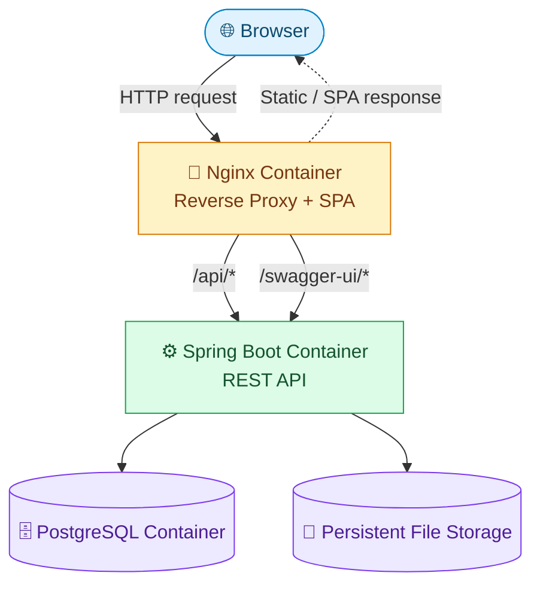
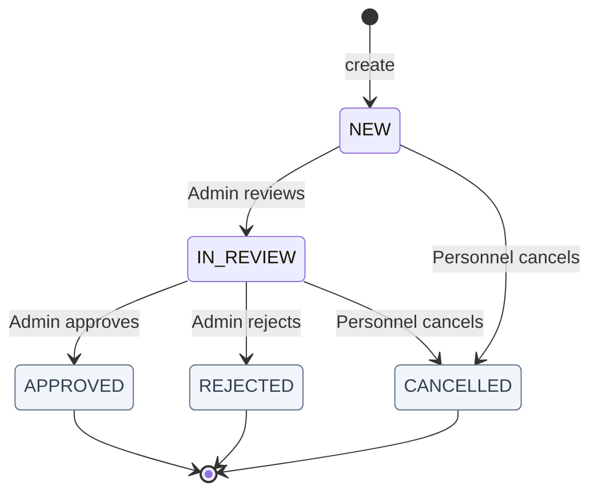
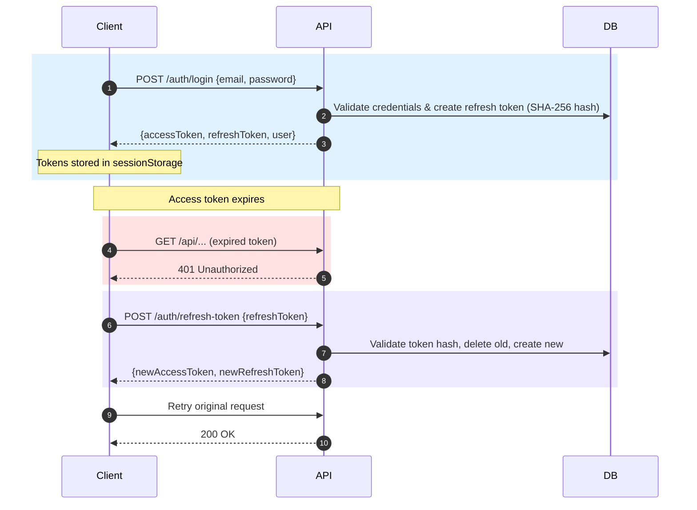
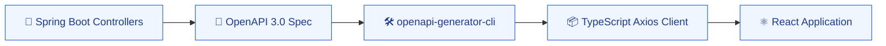
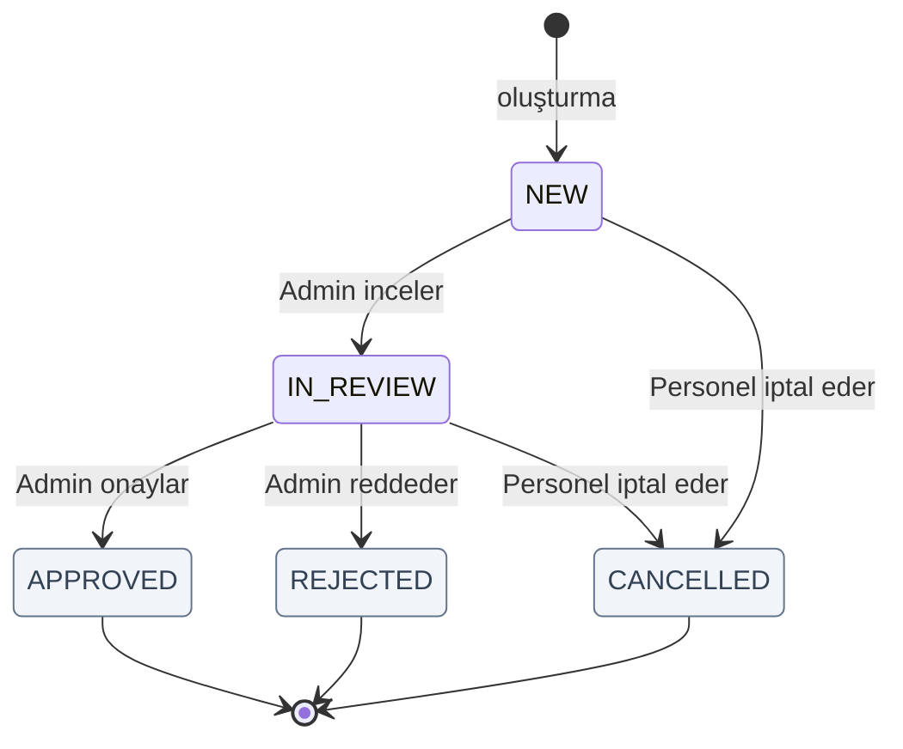
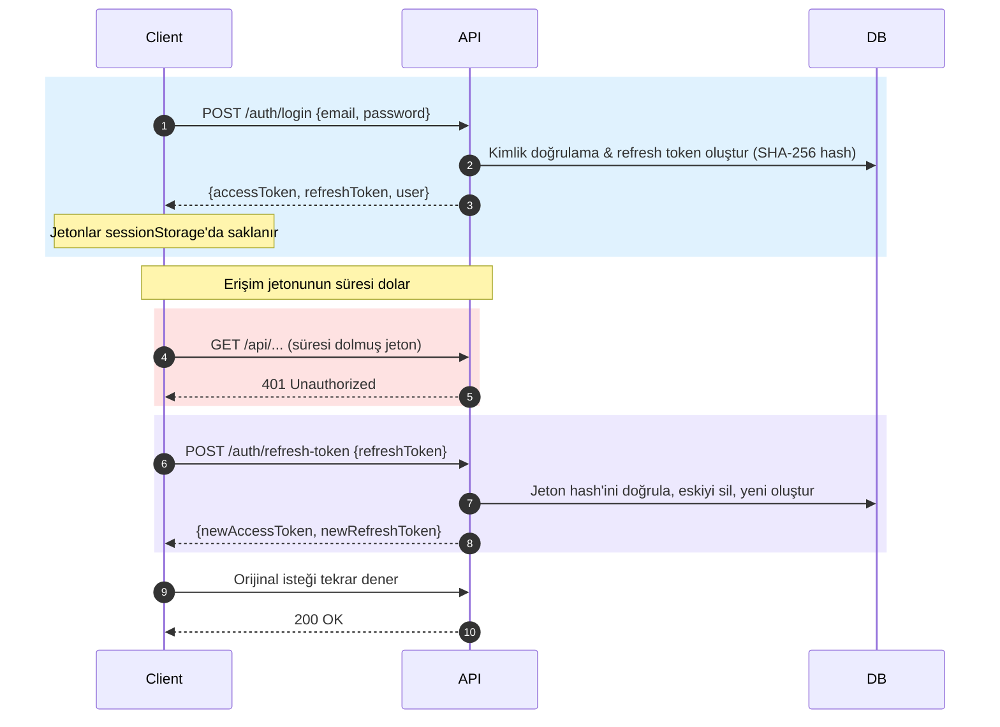
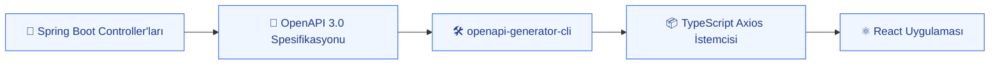

<a id="top-en"></a>
<div align="center">

**🇬🇧 [English](#top-en) &nbsp;|&nbsp; 🇹🇷 [Türkçe](#top-tr)**

</div>

# 🏢 APPLICATION MANAGEMENT SYSTEM

> Enterprise application workflow platform built with Spring Boot + React + PostgreSQL + Docker

<div align="center">

[Architecture](#system-architecture) · [API Docs](#api-endpoints) · [Screenshots](#screenshots) · [Installation](#installation)

</div>

---

<div align="center">
  
</div>

---

<a id="project-description"></a>
## 🎯 Project Description

Leave, training, advance, material, and assignment requests within organizations are often managed via scattered email threads, Excel spreadsheets, or verbal communication. This traditional approach lacks centralized tracking and makes it difficult to maintain a clear audit trail.

The **Application Management System** is a web-based platform where personnel can submit and track applications, while administrators can review, approve or reject, and generate reports on them. It provides a workflow supporting various form types, a status lifecycle, file attachments, and an analytics dashboard.

---

<div align="center">


<br/>


</div>

---

<a id="what-does-this-system-solve"></a>
## 💡 What does this system solve?

- Replaces scattered email/Excel requests with a centralized digital workflow.
- Provides a clear audit trail with an explicit approval lifecycle (`NEW` → `IN_REVIEW` → `APPROVED` / `REJECTED`).
- Secures application data using role-based JWT authentication.
- Automates reporting with dashboard KPIs and analytical summaries.
- Manages file attachments per application.

---

<a id="features"></a>
## ✨ Key Features

### 👤 Personnel
- Registration with email validation and custom password rules
- Login with access and refresh token pair
- Create applications (title, description, form type selection)
- View own applications with pagination, sorting, and filtering
- Edit, cancel, or delete applications (based on workflow rules)
- Upload, download, and delete file attachments
- Profile management

### 🛡️ Admin
- Dashboard with KPI cards and recent applications
- View all applications across the organization
- Advance applications through the review workflow (`IN_REVIEW`, `APPROVED`, `REJECTED`)
- User management (list, search, activate/deactivate, update)
- Form type management
- Filtered reports and analytics

---

<a id="system-architecture"></a>
## 🏗️ System Architecture

### 🔭 System at a Glance



<div align="center">
  
</div>

---

<a id="application-workflow"></a>
## 🔄 Application Workflow



| Status | 📄 Description | 👤 Triggered By | 🔀 Allowed Transitions |
|---|---|---|---|
| `NEW` | Freshly created application | System (on create) | → `IN_REVIEW`, → `CANCELLED` |
| `IN_REVIEW` | Under admin evaluation | Admin | → `APPROVED`, → `REJECTED`, → `CANCELLED` |
| `APPROVED` | Approved by admin | Admin | *Terminal — no further transitions* |
| `REJECTED` | Rejected by admin | Admin | *Terminal — no further transitions* |
| `CANCELLED` | Cancelled by applicant | Personnel | *Terminal — no further transitions* |

---

<a id="security-architecture"></a>
## 🔐 Security

- Spring Security stateless filter chain with `JwtAuthenticationFilter`.
- JWT via jjwt library with access and refresh tokens.
- Refresh token rotation (old token deleted on use, new pair issued).
- Method-level security via `@PreAuthorize`.



> [!IMPORTANT]
> **Token Storage Security:** SessionStorage is preferred over LocalStorage to ensure tokens are not persisted after the browser tab is closed. While this limits token persistence duration, it is not a standalone defense against XSS attacks.

---

<a id="dashboard--reporting"></a>
## 📊 Dashboard & Reporting

The dashboard and reporting modules provide dashboard metrics and analytical summaries.

<div align="center">
  
  
</div>

---

<a id="ui--ux-showcase"></a>
## 🎨 UI Screenshots

| ☀️ Light Mode | 🌙 Dark Mode |
|---|---|
|  |  |

| 🏠 Landing | 🔐 Authentication |
|---|---|
|  | <br/> |

| 📝 Applications | 🛠️ Administration |
|---|---|
| <br/><br/> | <br/><br/> |

| 👤 Profile | |
|---|---|
|  | |

---

<a id="key-technical-decisions"></a>
## 🧠 Technical Decisions

- **DTO + MapStruct:** Entities are never exposed to the API directly; compile-time mappers prevent runtime reflection overhead.
- **Specification Pattern:** Dynamic, type-safe, composable queries are used instead of raw SQL for filtering and searching.
- **Stateless Authentication:** Uses JWT with refresh token rotation. Refresh tokens are SHA-256 hashed in the database to mitigate token theft risks.
- **Flyway Migrations:** Flyway serves as the single source of truth for the database schema, with Hibernate configured in `validate` mode.
- **Global Exception Handling:** Provides consistent, machine-readable JSON error responses across all API endpoints using `@RestControllerAdvice`.
- **API Client Generation:** The TypeScript Axios client is generated from the OpenAPI specification, ensuring type safety between backend and frontend.
- **Feature-based Architecture:** The frontend uses a domain-driven directory structure (e.g., `features/applications/`) grouping related components, hooks, and schemas.
- **Docker + Nginx Proxy:** Single-origin deployment with SPA fallback and API reverse proxying to avoid CORS issues in production.

---

<a id="database"></a>
## 🗄️ Database

| Table | Purpose |
|---|---|
| `users` | User accounts |
| `form_types` | Application categories |
| `application_forms` | Submitted applications |
| `attachments` | Uploaded files |
| `refresh_tokens` | JWT refresh tokens |

<div align="center">
  
</div>

---

<a id="api-contract--openapi"></a>
## 🔌 API



**Key Endpoint Domains:**
- **Auth:** Registration, login, token refresh, logout
- **Users:** Profile management, admin user management, active/inactive toggling
- **Applications:** Creation, listing, detailed view, status transitions (review, approve, reject, cancel)
- **Attachments:** File upload, download, deletion
- **Form Types:** CRUD operations and activation status
- **Dashboard & Reports:** KPI aggregation and filtered analytical data

---

<a id="project-structure"></a>
## 📂 Project Structure

```text
application-management-system/
├── backend/
│   └── application-management/
│       ├── src/main/java/com/cybersoft/application_management/
│       │   ├── business/           # Status transition rules
│       │   ├── config/             # Configs
│       │   ├── controller/         # REST controllers
│       │   ├── dto/                # Request / Response DTOs
│       │   ├── entity/             # JPA entities
│       │   ├── enums/              # ApplicationStatus, UserRole
│       │   ├── exception/          # Typed exceptions + ErrorCode enum
│       │   ├── handler/            # GlobalExceptionHandler
│       │   ├── mapper/             # MapStruct mappers
│       │   ├── repository/         # JPA repositories & Specifications
│       │   ├── scheduler/          # Refresh token cleanup cron
│       │   ├── security/           # JWT filters and configuration
│       │   ├── service/            # Business logic and validators
│       │   └── storage/            # File storage abstraction
│       ├── src/main/resources/
│       │   └── db/migration/       # Flyway migration scripts
│       └── Dockerfile
├── frontend/
│   ├── src/
│   │   ├── api/                    # Axios instance and generated client
│   │   ├── app/                    # Router, theme, providers
│   │   ├── components/             # Shared UI components
│   │   ├── features/               # Domain-driven feature modules
│   │   └── lib/                    # Utilities
│   ├── Dockerfile
│   └── nginx.conf
├── docs/                           # Architecture diagrams and screenshots
└── docker-compose.yml
```

---

<a id="docker--deployment"></a>
## 🐳 Docker & Deployment

| Service | Internal Port | Purpose |
|---|---|---|
| `postgres` | 5432 | Database |
| `backend` | 8080 | Spring Boot REST API |
| `frontend` | 80 | SPA + Nginx Reverse Proxy |

> [!TIP]
> **Nginx Proxy Rules:** Nginx serves the React SPA and proxies `/api/*`, `/v3/*`, and `/swagger-ui/*` requests to the backend container.

---

<a id="testing--quality"></a>
## 🧪 Testing

- **Backend:** JUnit 5 unit tests for validators and Spring Boot context load tests.
- **Frontend:** TypeScript strict mode, ESLint validation.
- **Tooling Ready:** Playwright and axe-core dependencies are installed for future end-to-end and accessibility testing.

---

<a id="installation"></a>
## 🚀 Installation

### 🐳 Docker (Recommended)

```bash
git clone <repository-url>
cd application-management-system
cp .env.example .env
# Fill in required values in .env
docker compose up --build
```

### 💻 Development Setup

**Backend:**
```bash
cd backend/application-management
./mvnw spring-boot:run
```

**Frontend:**
```bash
cd frontend
npm install
npm run dev
```

---

<a id="environment-variables"></a>
## ⚙️ Environment Variables

From `.env.example`:

| Variable | Purpose |
|---|---|
| `POSTGRES_DB` | Database name |
| `POSTGRES_USER` | Database user |
| `POSTGRES_PASSWORD` | Database password |
| `JWT_SECRET` | JWT signing key |
| `JWT_ACCESS_EXPIRATION` | Access token TTL (ms) |
| `JWT_REFRESH_EXPIRATION` | Refresh token TTL (ms) |
| `ADMIN_EMAIL` | Initial admin email |
| `ADMIN_PASSWORD` | Initial admin password |

*(Additional variables for ports and host names are also available.)*

---

<a id="roadmap"></a>
## 🗺️ Roadmap

**✅ Completed:**
- Backend REST API and JWT authentication
- Application workflow with status transitions
- File attachment management
- Admin dashboard and reports
- React frontend with custom MUI theme
- Docker Compose deployment

**⏳ Planned:**
- Dedicated audit logging/history subsystem
- Excel / PDF export
- Email notifications
- CI/CD pipeline
- End-to-end test suite (Playwright)

---

<a id="future-improvements"></a>
## 🔮 Future Improvements
- 🔔 In-app Notification Center
- 💬 Application Comments/Notes
- 🌍 Multi-language Support (i18n)
- ⏱️ API Rate Limiting

---

<a id="project-information"></a>
## ℹ️ Project Information
Corporate Application and Form Management System developed with Spring Boot and React.

---

<a id="license"></a>
## 📄 License
Developer — [Eray Yalman] (Internship Project, Cybersoft)
This project was developed for educational/internship purposes.

---

<a id="top-tr"></a>
<div align="center">

**🇬🇧 [English](#top-en) &nbsp;|&nbsp; 🇹🇷 [Türkçe](#top-tr)**

</div>

# 🏢 UYGULAMA YÖNETİM SİSTEMİ

> Spring Boot + React + PostgreSQL + Docker ile geliştirilmiş kurumsal başvuru ve iş akışı platformu.

<div align="center">

[Mimari](#system-architecture-tr) · [API Dokümantasyonu](#api-endpoints-tr) · [Ekran Görüntüleri](#screenshots-tr) · [Kurulum](#installation-tr)

</div>

---

<div align="center">
  
</div>

---

<a id="project-description-tr"></a>
## 🎯 Proje Tanımı

Kurumlarda izin, eğitim, avans, malzeme ve görevlendirme talepleri çoğunlukla dağınık e-posta yazışmaları, Excel tabloları veya sözlü iletişim yoluyla yönetilir. Bu geleneksel yaklaşım merkezi bir takip imkânı sunmaz ve net bir denetim izi (audit trail) tutmayı zorlaştırır.

**Uygulama Yönetim Sistemi**, personelin başvuru oluşturup takip edebildiği, yöneticilerin ise bu başvuruları inceleyip onaylayabildiği/reddedebildiği ve raporlayabildiği web tabanlı bir platformdur. Çeşitli form tiplerini, durum yaşam döngüsünü, dosya eklerini ve analitik gösterge panelini destekleyen bir iş akışı sunar.

---

<div align="center">


<br/>


</div>

---

<a id="what-does-this-system-solve-tr"></a>
## 💡 Bu sistem neyi çözüyor?

- Dağınık e-posta/Excel taleplerini merkezi bir dijital iş akışıyla değiştirir.
- Açık bir onay yaşam döngüsüyle (`NEW` → `IN_REVIEW` → `APPROVED` / `REJECTED`) net bir denetim izi sağlar.
- Rol tabanlı JWT kimlik doğrulaması kullanarak başvuru verilerini güvence altına alır.
- Gösterge paneli KPI'ları ve analitik özetlerle raporlamayı otomatikleştirir.
- Başvurulara ait dosya eklerinin yönetimini kolaylaştırır.

---

<a id="features-tr"></a>
## ✨ Temel Özellikler

### 👤 Personel
- E-posta doğrulama ve özel şifre kurallarıyla kayıt olma
- Erişim ve yenileme jetonu çiftiyle giriş yapma
- Başvuru oluşturma (başlık, açıklama, form tipi seçimi)
- Kendi başvurularını sayfalama, sıralama ve filtreleme ile görüntüleme
- Başvuruları düzenleme, iptal etme veya silme (iş akışı kurallarına bağlı olarak)
- Dosya eki yükleme, indirme ve silme
- Profil yönetimi

### 🛡️ Yönetici
- KPI kartları ve son başvuruları içeren gösterge paneli
- Kurumdaki tüm başvuruları görüntüleme
- İnceleme iş akışında başvuruları ilerletme (`IN_REVIEW`, `APPROVED`, `REJECTED`)
- Kullanıcı yönetimi (listeleme, arama, aktif/pasif etme, güncelleme)
- Form tipi yönetimi
- Filtrelenmiş raporlar ve analitikler

---

<a id="system-architecture-tr"></a>
## 🏗️ Sistem Mimarisi

### 🔭 Sistem Genel Bakış


<div align="center">
  
</div>

---

<a id="application-workflow-tr"></a>
## 🔄 Başvuru İş Akışı



| Durum | 📄 Açıklama | 👤 Tetikleyen | 🔀 İzin Verilen Geçişler |
|---|---|---|---|
| `NEW` | Yeni oluşturulmuş başvuru | Sistem (oluşturmada) | → `IN_REVIEW`, → `CANCELLED` |
| `IN_REVIEW` | Admin değerlendirmesinde | Admin | → `APPROVED`, → `REJECTED`, → `CANCELLED` |
| `APPROVED` | Admin tarafından onaylandı | Admin | *Nihai (terminal) — başka geçiş yok* |
| `REJECTED` | Admin tarafından reddedildi | Admin | *Nihai (terminal) — başka geçiş yok* |
| `CANCELLED` | Başvuru sahibi tarafından iptal edildi | Personel | *Nihai (terminal) — başka geçiş yok* |

---

<a id="security-architecture-tr"></a>
## 🔐 Güvenlik

- `JwtAuthenticationFilter` ile durumsuz (stateless) Spring Security filtre zinciri.
- Erişim ve yenileme jetonları içeren jjwt tabanlı JWT yapısı.
- Refresh token rotasyonu (kullanılan eski jeton silinir, yeni çift verilir).
- `@PreAuthorize` ile metot düzeyinde güvenlik.



> [!IMPORTANT]
> **Jeton Saklama Güvenliği:** Jetonların tarayıcı sekmesi kapatıldıktan sonra kalıcı olmamasını sağlamak için localStorage yerine sessionStorage tercih edilmiştir. Bu tercih jeton kalıcılık süresini sınırlar, ancak XSS saldırılarına karşı tek başına bir koruma mekanizması değildir.

---

<a id="dashboard--reporting-tr"></a>
## 📊 Gösterge Paneli & Raporlama

Gösterge paneli ve raporlama modülleri, metrikleri ve analitik özetleri sunar.

<div align="center">
  
  
</div>

---

<a id="ui--ux-showcase-tr"></a>
## 🎨 Arayüz Ekran Görüntüleri

| ☀️ Aydınlık Mod | 🌙 Karanlık Mod |
|---|---|
|  |  |

| 🏠 Landing | 🔐 Kimlik Doğrulama |
|---|---|
|  | <br/> |

| 📝 Başvurular | 🛠️ Yönetim |
|---|---|
| <br/><br/> | <br/><br/> |

| 👤 Profil | |
|---|---|
|  | |

---

<a id="key-technical-decisions-tr"></a>
## 🧠 Teknik Kararlar

- **DTO + MapStruct:** Entity'ler doğrudan API'ye açılmaz; derleme zamanı mapper'lar, çalışma zamanı reflection maliyetlerini önler.
- **Specification Pattern:** Filtreleme ve arama işlemleri için ham SQL yerine dinamik ve tip güvenli sorgular kullanılır.
- **Durumsuz (Stateless) Kimlik Doğrulama:** Refresh token rotasyonuyla JWT kullanılmıştır. Jeton hırsızlığı risklerini azaltmak için yenileme jetonları veritabanında SHA-256 ile hash'lenmiş olarak saklanır.
- **Flyway Migrasyonları:** Veritabanı şeması için tek doğruluk kaynağı Flyway'dir; Hibernate `validate` modunda yapılandırılmıştır.
- **Genel Hata Yönetimi:** `@RestControllerAdvice` ile tüm API endpoint'lerinde tutarlı, JSON formatında hata yanıtları sağlanır.
- **API İstemci Üretimi:** TypeScript Axios istemcisi, OpenAPI spesifikasyonundan otomatik olarak üretilerek backend ve frontend arasında tip güvenliği garanti edilir.
- **Özellik Bazlı Mimari:** Frontend, ilgili bileşenleri, hook'ları ve şemaları gruplayan domain odaklı bir dizin yapısı (örn. `features/applications/`) kullanır.
- **Docker + Nginx Proxy:** Üretimde CORS sorunlarını önlemek için SPA fallback ve API reverse proxy yetenekleriyle tek kaynaklı dağıtım gerçekleştirilmiştir.

---

<a id="database-tr"></a>
## 🗄️ Veritabanı

| Tablo | Amaç |
|---|---|
| `users` | Kullanıcı hesapları |
| `form_types` | Başvuru kategorileri |
| `application_forms` | Gönderilen başvurular |
| `attachments` | Yüklenen dosyalar |
| `refresh_tokens` | JWT yenileme jetonları |

<div align="center">
  
</div>

---

<a id="api-contract--openapi-tr"></a>
## 🔌 API



**Temel Endpoint Grupları:**
- **Auth:** Kayıt, giriş, jeton yenileme, çıkış
- **Users:** Profil yönetimi, yönetici kullanıcı yönetimi, aktif/pasif durumu değiştirme
- **Applications:** Oluşturma, listeleme, detaylı görünüm, durum geçişleri (inceleme, onay, ret, iptal)
- **Attachments:** Dosya yükleme, indirme, silme
- **Form Types:** CRUD işlemleri ve aktiflik durumu
- **Dashboard & Reports:** KPI hesaplamaları ve filtrelenmiş analitik veriler

---

<a id="project-structure-tr"></a>
## 📂 Proje Yapısı

```text
application-management-system/
├── backend/
│   └── application-management/
│       ├── src/main/java/com/cybersoft/application_management/
│       │   ├── business/           # Durum geçiş kuralları
│       │   ├── config/             # Konfigürasyonlar
│       │   ├── controller/         # REST controller'ları
│       │   ├── dto/                # Request / Response DTO'ları
│       │   ├── entity/             # JPA entity'leri
│       │   ├── enums/              # ApplicationStatus, UserRole
│       │   ├── exception/          # Tipli exception'lar + ErrorCode enum'u
│       │   ├── handler/            # GlobalExceptionHandler
│       │   ├── mapper/             # MapStruct mapper'ları
│       │   ├── repository/         # JPA repository'leri ve Spesifikasyonlar
│       │   ├── scheduler/          # Refresh token temizlik cron'u
│       │   ├── security/           # JWT filtreleri ve güvenlik ayarları
│       │   ├── service/            # İş mantığı ve validator'lar
│       │   └── storage/            # Dosya depolama soyutlaması
│       ├── src/main/resources/
│       │   └── db/migration/       # Flyway migrasyon scriptleri
│       └── Dockerfile
├── frontend/
│   ├── src/
│   │   ├── api/                    # Axios instance ve otomatik üretilen istemci
│   │   ├── app/                    # Router, tema, provider'lar
│   │   ├── components/             # Ortak UI bileşenleri
│   │   ├── features/               # Domain odaklı özellik modülleri
│   │   └── lib/                    # Yardımcı araçlar
│   ├── Dockerfile
│   └── nginx.conf
├── docs/                           # Mimari diyagramlar ve ekran görüntüleri
└── docker-compose.yml
```

---

<a id="docker--deployment-tr"></a>
## 🐳 Docker & Dağıtım

| Servis | İç Port | Amaç |
|---|---|---|
| `postgres` | 5432 | Veritabanı |
| `backend` | 8080 | Spring Boot REST API |
| `frontend` | 80 | SPA + Nginx Reverse Proxy |

> [!TIP]
> **Nginx Proxy Kuralları:** Nginx, React SPA uygulamasını sunar ve `/api/*`, `/v3/*`, ve `/swagger-ui/*` isteklerini backend container'ına yönlendirir.

---

<a id="testing--quality-tr"></a>
## 🧪 Test İşlemleri

- **Backend:** Validator'lar ve Spring Boot context yükleme için JUnit 5 birim testleri.
- **Frontend:** TypeScript strict modu, ESLint doğrulaması.
- **Araçlar:** Uçtan uca testler ve erişilebilirlik testleri için Playwright ve axe-core bağımlılıkları yüklenmiştir.

---

<a id="installation-tr"></a>
## 🚀 Kurulum

### 🐳 Docker (Önerilen)

```bash
git clone <repository-url>
cd application-management-system
cp .env.example .env
# .env dosyasındaki gerekli değerleri doldurun
docker compose up --build
```

### 💻 Geliştirme Ortamı

**Backend:**
```bash
cd backend/application-management
./mvnw spring-boot:run
```

**Frontend:**
```bash
cd frontend
npm install
npm run dev
```

---

<a id="environment-variables-tr"></a>
## ⚙️ Ortam Değişkenleri

`.env.example` dosyasından:

| Değişken | Amaç |
|---|---|
| `POSTGRES_DB` | Veritabanı adı |
| `POSTGRES_USER` | Veritabanı kullanıcısı |
| `POSTGRES_PASSWORD` | Veritabanı şifresi |
| `JWT_SECRET` | JWT imzalama anahtarı |
| `JWT_ACCESS_EXPIRATION` | Erişim jetonu TTL (ms) |
| `JWT_REFRESH_EXPIRATION` | Yenileme jetonu TTL (ms) |
| `ADMIN_EMAIL` | İlk admin e-postası |
| `ADMIN_PASSWORD` | İlk admin şifresi |

*(Port ve host isimleri için ek değişkenler de mevcuttur.)*

---

<a id="roadmap-tr"></a>
## 🗺️ Yol Haritası

**✅ Tamamlanan:**
- Backend REST API ve JWT kimlik doğrulaması
- Durum geçişlerini içeren başvuru iş akışı
- Dosya eki yönetimi
- Yönetici gösterge paneli ve raporlar
- Özel MUI temasına sahip React frontend
- Docker Compose ile dağıtım

**⏳ Planlanan:**
- Ayrı denetim günlüğü/geçmiş alt sistemi
- Excel / PDF dışa aktarma
- E-posta bildirimleri
- CI/CD pipeline'ı
- Uçtan uca test paketi (Playwright)

---

<a id="future-improvements-tr"></a>
## 🔮 Gelecek İyileştirmeler
- 🔔 Uygulama İçi Bildirim Merkezi
- 💬 Başvuru Yorumları/Notları
- 🌍 Çoklu Dil Desteği (i18n)
- ⏱️ API Hız Sınırlama (Rate Limiting)

---

<a id="project-information-tr"></a>
## ℹ️ Proje Bilgisi
Spring Boot ve React ile geliştirilmiş Kurumsal Başvuru ve Form Yönetim Sistemi.

---

<a id="license-tr"></a>
## 📄 Lisans
Geliştirici — [Eray Yalman] (Staj Projesi, Cybersoft)
Bu proje eğitim/staj amaçlı geliştirilmiştir.
